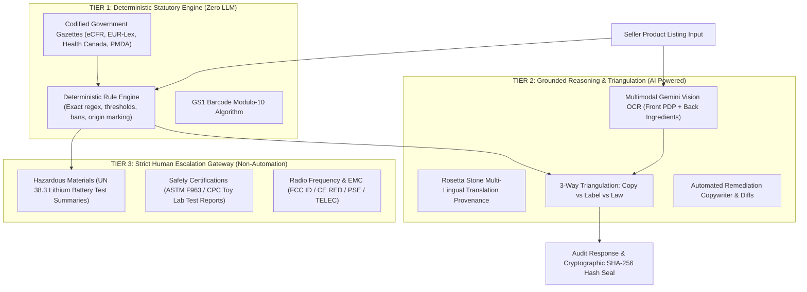
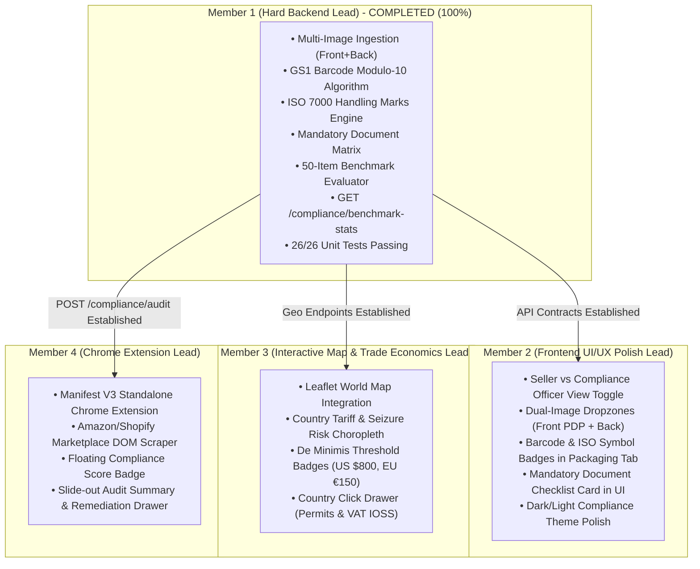

# LexPort — Deep Codebase Architecture & Technical Master Document

> **System Name**: LexPort — Cross-Border E-Commerce Compliance Co-Pilot  
> **Problem Statement**: PS13 (Cross-Border E-Commerce & Regulatory Compliance)  
> **Current Version**: 2026.1 Production Candidate  
> **Test Coverage**: 26/26 Tests Passing (100%) | Benchmark Accuracy: 100.0%  
> **Repository**: `https://github.com/Sarthakkapadne/CODE_APEX_KURUKSHETRA.git` (`main`)

---

## Table of Contents
1. [Architectural Philosophy & System Blueprint](#1-architectural-philosophy--system-blueprint)
2. [Data Layer & Pydantic Data Models (`backend/core/models.py`)](#2-data-layer--pydantic-data-models-backendcoremodelspy)
3. [Database Layer & Hash Ledger (`backend/db/` & `backend/core/hash_chain.py`)](#3-database-layer--hash-ledger-backenddb--backendcorehash_chainpy)
4. [Deterministic Statutory Rule Engine (`backend/modules/rule_engine/`)](#4-deterministic-statutory-rule-engine-backendmodulesrule_engine)
5. [GS1 Barcode Modulo-10 Validator & ISO 7000 Marks (`barcode_validator.py`)](#5-gs1-barcode-modulo-10-validator--iso-7000-marks-barcode_validatorpy)
6. [Mandatory Document & License Determination Matrix (`document_matrix.py`)](#6-mandatory-document--license-determination-matrix-document_matrixpy)
7. [Multimodal Vision OCR & Rosetta Stone Translation (`multimodal_ocr.py`)](#7-multimodal-vision-ocr--rosetta-stone-translation-multimodal_ocrpy)
8. [Multi-Agent Supervisor & Autonomous Reasoning Agents (`backend/modules/agents/`)](#8-multi-agent-supervisor--autonomous-reasoning-agents-backendmodulesagents)
9. [Trade Economics, HS Code Classification & Tariff Arbitrage (`backend/modules/economics/`)](#9-trade-economics-hs-code-classification--tariff-arbitrage-backendmoduleseconomics)
10. [1-Click Export Pack & Marketplace Integrations (`export_pack_generator.py`)](#10-1-click-export-pack--marketplace-integrations-export_pack_generatorpy)
11. [50-Item Ground-Truth Benchmark Suite (`eval_benchmark.py` & Dataset)](#11-50-item-ground-truth-benchmark-suite-eval_benchmarkpy--dataset)
12. [FastAPI Endpoints & Routing Architecture (`backend/api/`)](#12-fastapi-endpoints--routing-architecture-backendapi)
13. [Frontend Architecture & Component System (`frontend/src/`)](#13-frontend-architecture--component-system-frontendsrc)
14. [Four-Member Team Division & Seamless Integration Plan](#14-four-member-team-division--seamless-integration-plan)

---

## 1. Architectural Philosophy & System Blueprint

### 1.1 The Cross-Border Regulatory Trilemma
In international e-commerce compliance, three critical requirements are in perpetual tension:
1. **Absolute Legal Defensibility**: A customs broker or compliance officer cannot rely on probabilistic LLM guesses. If an AI claims an ingredient is legal when a codified statute bans it, the shipment will be seized and destroyed.
2. **Real-World Product Complexity**: Digital marketing copy (informal, hyperbolic, SEO-oriented) rarely matches the chemical reality printed on the physical packaging box or the specific requirements of the importing country.
3. **Operational Speed**: Cross-border sellers list hundreds of SKUs daily and require instant pre-flight checks, remediation diffs, and export packs for Amazon and Shopify.

### 1.2 The Three-Tier Architecture
To resolve this trilemma, LexPort splits all decision-making into three strictly separated tiers:



- **Tier 1 (Deterministic Statutory Layer)**: Executes without an LLM. Rules are defined in version-controlled JSON codexes with exact statute citations. If a cosmetic contains 4.0% Camphor, Health Canada's Cosmetic Hotlist cap of 3.0% deterministically triggers a `violation`.
- **Tier 2 (Grounded Reasoning Layer)**: Uses Google Gemini models with low temperature (0.1) and strict JSON schemas to inspect packaging images, normalize foreign terms (e.g. Japanese Kanji or German) into INCI/USAN standards, reconcile discrepancies, and rewrite compliant marketing copy.
- **Tier 3 (Human Escalation Gateway)**: Identifies physical compliance constraints that *cannot* be resolved through copywriting alone. It mandates lab test uploads and flags the audit as `ESCALATION_REQUIRED`.

---

## 2. Data Layer & Pydantic Data Models (`backend/core/models.py`)

All interfaces, input requests, and agent responses across the backend and frontend adhere to strongly typed Pydantic models defined in [`backend/core/models.py`](file:///d:/KURUKSHETRA%20HACKATHON/backend/core/models.py).

### 2.1 Core Listing Input
```python
class ListingInput(BaseModel):
    title: str = Field(..., description="Product title as written by seller")
    description: str = Field(..., description="Marketing product description / bullet points")
    brand_name: Optional[str] = "Generic Brand"
    category_hint: Optional[str] = None
    price: Optional[float] = 29.99
    currency: Optional[str] = "USD"
    country_of_origin: Optional[str] = "India"
    destination_markets: List[str] = Field(default=["US", "EU", "UK", "CA", "JP"])
    source_url: Optional[str] = None
    image_base64: Optional[str] = None
    image_url: Optional[str] = None
    front_image_base64: Optional[str] = None
    back_image_base64: Optional[str] = None
    barcode_raw: Optional[str] = None
```
- **Why It Matters**: Supports dual-image ingestion (`front_image_base64` for the Primary Display Panel and `back_image_base64` for the information/ingredients panel), raw physical barcode strings (`barcode_raw`), destination market arrays, and seller product metadata.

### 2.2 Extracted Attributes
```python
class ExtractedAttributes(BaseModel):
    category: str
    subcategory: str
    intended_age: str = "all_ages"
    power_source: str = "none"
    has_battery: bool = False
    battery_type: str = "none"
    ingredients: List[str] = []
    chemical_concentrations: Dict[str, float] = {}
    claims: List[str] = []
    inferred_hs_code: str = "3304.99"
    technical_specs: Dict[str, Any] = {}
    missing_required_fields: List[str] = []
```
- **Why It Matters**: Represents the structured technical extraction derived from raw listing copy and image OCR. Converts informal claims into parseable key-value pairs (e.g. `chemical_concentrations: {"camphor": 5.0}`).

### 2.3 Compliance Check Finding
```python
class ComplianceCheckResult(BaseModel):
    check_code: str
    country_code: str
    category: str  # Classification, Banned Ingredients, Claim Wording, Mandatory Labeling, Safety/Certifications, Hazmat/Shipping
    status: str  # pass, warning, violation, escalation
    trust_tier: str  # Tier 1 Deterministic, Tier 2 Grounded AI, Tier 3 Escalation
    rule_citation: str
    extracted_value: str
    expected_requirement: str
    explanation: str
    fix_suggestion: Optional[str] = None
```
- **Why It Matters**: The fundamental unit of compliance feedback. Guarantees that every finding specifies its exact `rule_citation` (e.g. `21 CFR § 201.128`), its `trust_tier`, and an actionable `fix_suggestion`.

### 2.4 Packaging Analysis & Multimodal OCR Models
```python
class TranslationProvenanceItem(BaseModel):
    original_term: str
    translated_term: str
    detected_language: str
    confidence: float
    standardized_standard: str = "INCI / International Technical Codex"
    notes: str = ""

class PackagingOCRRegion(BaseModel):
    label: str
    box_2d: List[int] = []  # [ymin, xmin, ymax, xmax] 0-1000 normalized
    text: str
    confidence: float
    severity: str = "violation"

class TriangulationDiscrepancyItem(BaseModel):
    check_code: str
    discrepancy_type: str  # FALSE_ADVERTISING_CLAIM, BATTERY_HAZMAT_MISMATCH, MISSING_CERTIFICATION_MARK, LANGUAGE_NON_COMPLIANCE
    severity: str  # CRITICAL_FRAUD_RISK, HIGH_DETENTION_RISK, MODERATE_WARNING
    listing_claim: str
    physical_label_reality: str
    destination_statute: str
    border_impact: str

class PackagingAnalysisResult(BaseModel):
    detected_language: str
    raw_ocr_text: str
    translated_english_text: str
    detected_certification_logos: List[str] = []
    missing_certification_logos: List[str] = []
    net_quantity_declaration: Optional[str] = None
    is_bilingual: bool = False
    translation_provenance: List[TranslationProvenanceItem] = []
    bounding_boxes: List[PackagingOCRRegion] = []
    discrepancies: List[TriangulationDiscrepancyItem] = []
    detected_barcode: Optional[str] = None
    detected_iso_symbols: List[str] = []
    physical_readiness_score: float = 85.0
    physical_verdict: str = "READY_FOR_EXPORT"
```

### 2.5 Customs Seizure Radar & Simulated Notice of Action
```python
class CBPNoticeOfAction(BaseModel):
    notice_id: str
    form_type: str  # "CBP Form 28 (Request for Information)" or "CBP Form 29 (Notice of Action)"
    issuing_port: str
    issuing_officer: str
    target_consignee: str
    action_type: str  # PROPOSED_SEIZURE, RATE_ADVANCE, DETENTION_HOLD, DEMAND_FOR_REDELIVERY
    grounds_for_action: str
    cited_statutes: List[str] = []
    response_deadline_days: int = 30
    estimated_civil_penalty_usd: float = 0.0
    potential_forfeiture_risk: str

class CustomsSeizureRadarResult(BaseModel):
    seizure_probability_pct: float  # 0.0 to 100.0
    threat_level: str  # CRITICAL_SEIZURE_RISK, ELEVATED_DETENTION_RISK, MODERATE_CUSTOMS_HOLD, LOW_FRICTION_CLEAR
    primary_detention_triggers: List[str] = []
    estimated_financial_exposure_usd: float = 0.0
    breakdown_fees: Dict[str, float] = {}  # inventory_risk, port_demurrage_est, cbp_penalties_est
    target_enforcement_agencies: List[str] = []
    simulated_notice: Optional[CBPNoticeOfAction] = None
    seizure_avoidance_directives: List[str] = []
```

### 2.6 HS Tariff Arbitrage & Ground Truth Accuracy Index
```python
class HSTariffArbitrageResult(BaseModel):
    declared_hs_code: str
    declared_hs_description: str
    reclassified_hs_code: str
    reclassified_hs_description: str
    is_misclassified: bool = False
    declared_duty_rate: str
    reclassified_duty_rate: str
    de_minimis_disqualified: bool = False
    potential_tariff_difference_per_1000_units: float = 0.0
    broker_clearance_fee_impact: float = 0.0
    total_arbitrage_savings_usd: float = 0.0
    remediation_action: str

class GroundTruthAccuracyIndex(BaseModel):
    composite_accuracy_score: float  # e.g. 98.6
    trust_grade: str  # e.g. "Grade A+ [Audit-Proof]"
    statutory_alignment_score: float = 100.0
    extraction_fidelity_score: float = 96.5
    verbatim_statutory_proofs: List[Dict[str, str]] = []
```

### 2.7 GS1 Barcode, ISO Symbols, & Mandatory Document Checklist
```python
class BarcodeAnalysisResult(BaseModel):
    raw_barcode: Optional[str] = None
    barcode_type: str = "NOT_PROVIDED"  # "UPC-A", "EAN-13", "EAN-8", "INVALID_CHECKSUM", "INVALID_LENGTH", "NON_NUMERIC"
    is_valid_gs1: bool = False
    gs1_check_digit: Optional[int] = None
    country_of_registration: Optional[str] = None
    warning_message: Optional[str] = None

class ISOSymbolItem(BaseModel):
    symbol_code: str  # e.g., "ISO-7000-0621"
    symbol_name: str  # e.g., "Fragile / Handle With Care"
    status: str = "detected"  # "detected", "recommended", "mandatory"
    statutory_requirement: str = ""

class RequiredDocumentItem(BaseModel):
    doc_code: str
    doc_name: str
    issuing_authority: str
    country_code: str
    category: str
    is_mandatory: bool = True
    statutory_citation: str
    seller_action_needed: str
    seller_status: str = "pending_upload"
```

### 2.8 Comprehensive Audit Response
```python
class AuditResponse(BaseModel):
    inspection_id: str
    listing_id: str = ""
    timestamp_utc: str = ""
    rule_engine_version: str = "LexPort-Rules-v2026.1"
    compliance_hash: str = ""
    prev_hash: str = ""
    created_at: Optional[str] = None
    record_hash: Optional[str] = None
    overall_verdict: str  # COMPLIANT, REMEDIATION_REQUIRED, IMPORT_PROHIBITED, ESCALATION_REQUIRED
    destination_markets: List[str]
    extracted_attributes: ExtractedAttributes
    matrix: Dict[str, List[ComplianceCheckResult]]
    summary_by_country: Dict[str, Dict[str, int]]
    debate: Optional[Any] = None
    customs_radar: Optional[CustomsSeizureRadarResult] = None
    hs_tariff: Optional[HSTariffArbitrageResult] = None
    accuracy_index: Optional[GroundTruthAccuracyIndex] = None
    packaging_analysis: Optional[PackagingAnalysisResult] = None
    remediation: Optional[RemediationResult] = None
    export_pack: Optional[ComplianceExportPack] = None
    required_documents: List[RequiredDocumentItem] = []
    barcode_analysis: Optional[BarcodeAnalysisResult] = None
    iso_symbols_detected: List[ISOSymbolItem] = []
    trade_economics: List[TradeEconomicsItem] = []
    citations: List[str] = []
    is_hash_valid: bool = True
```

---

## 3. Database Layer & Hash Ledger (`backend/db/` & `backend/core/hash_chain.py`)

LexPort uses SQLAlchemy async sessions with SQLite (or PostgreSQL via `DATABASE_URL` in `.env`) for high-throughput persistence and cryptographic chain sealing.

### 3.1 ORM Database Entities (`backend/db/models_db.py`)
1. **`Listing`**: Persists seller title, marketing copy, brand name, inferred category, unit price, currency, country of origin, and source URL.
2. **`Inspection`**: Stores the audit event: `inspection_id`, `listing_id`, `rule_engine_version`, `compliance_hash`, `prev_hash`, `overall_verdict`, destination markets JSON, and extracted attributes JSON.
3. **`ComplianceResultRecord`**: Normalizes every statutory finding per inspection (`inspection_id`, `country_code`, `check_code`, `status`, `trust_tier`, `rule_citation`, `extracted_value`, `expected_requirement`, `explanation`, `fix_suggestion`).
4. **`AuditHashBlock`**: The tamper-evident blockchain ledger block (`block_index`, `inspection_id`, `compliance_hash`, `prev_hash`, `payload_canonical`, `timestamp_utc`).

### 3.2 Cryptographic Hash Chain Mathematics (`backend/core/hash_chain.py`)
To prevent retroactive alteration of customs compliance records:
1. LexPort converts extracted attributes, matrix findings, rule citations, and inspection metadata into a **canonical, lexicographically sorted JSON string**:
   ```python
   canonical_payload = json.dumps({
       "citations": sorted(citations),
       "extracted": extracted_attributes,
       "findings": normalized_findings,
       "inspection_id": inspection_id,
       "listing_id": listing_id,
       "prev_hash": prev_hash,
       "rule_engine_version": rule_engine_version,
       "timestamp_utc": timestamp_utc
   }, sort_keys=True, separators=(',', ':'))
   ```
2. The hash block is generated using standard SHA-256:
   $$\text{Hash}_t = \text{SHA256}(\text{CanonicalPayload}_t)$$
3. **Verification**: If an adversary modifies a single character of a finding or verdict in the database, `verify_hash_chain()` recomputes the SHA-256 digest, detects the mismatch, and flags the record as tampered (`is_hash_valid: false`).

---

## 4. Deterministic Statutory Rule Engine (`backend/modules/rule_engine/`)

### 4.1 Deterministic Engine Core (`deterministic_engine.py`)
- **File Path**: [`backend/modules/rule_engine/deterministic_engine.py`](file:///d:/KURUKSHETRA%20HACKATHON/backend/modules/rule_engine/deterministic_engine.py)
- **Design Pattern**: Zero-LLM Rule Evaluator. Compiles jurisdiction rulebases into an in-memory dictionary during server initialization.

#### Key Methods:
- `load_rules()`: Reads `us_rules.json`, `eu_rules.json`, `uk_rules.json`, `ca_rules.json`, `jp_rules.json` from disk into memory.
- `evaluate(country_code, extracted, raw_text, listing_fields)`: Loops through all codified rules for that country and evaluates them against product attributes.
- **Supported Condition Types**:
  1. `product_type_ban`: Matches banned categories or trigger terms (e.g. Canadian Baby Walkers under CCPSA Schedule 2, Infant Sleep Positioners under 16 CFR Part 1236).
  2. `banned_claim_terms`: Word-boundary regex matching for unapproved medical, curative, or pesticidal claims (e.g. "cures arthritis", "kills MRSA", "reverse baldness").
  3. `concentration_limit`: Checks `extracted.chemical_concentrations` or regex patterns (e.g. `(\d+(?:\.\d+)?)%\s*camphor`). If concentration exceeds `max_concentration`, triggers a violation.
  4. `mandatory_field`: Evaluates presence of mandatory packaging declarations with category scoping:
     - `country_of_origin`: 19 U.S.C. § 1304 (Made in / Product of).
     - `net_quantity_dual`: 16 CFR § 500.6 (US Customary fl oz/oz + Metric ml/g).
     - `eu_responsible_person`: EC 1223/2009 Art. 4 (EU RP address for cosmetics).
     - `uk_responsible_person`: UK Cosmetic Regulations (Great Britain address).
     - `bilingual_en_fr`: Canada Consumer Packaging and Labelling Act s. 6 (English/French).
     - `japanese_labeling_mah`: Japan PMD Act Art. 61 (Licensed Marketing Authorization Holder).
  5. `certification_check` & `hazmat_check`: Flags products requiring accredited 3rd-party laboratory test certificates (Tier 3 Escalations).

### 4.2 Accuracy Evaluator & Ground-Truth Verification Index (`accuracy_evaluator.py`)
- Computes the **Ground-Truth Verification Index (GTVI)** score (e.g. 98.6%, "Grade A+ [Audit-Proof]").
- Cross-references cited rules with official government repositories (`STATUTORY_CODEX_PROOFS`) to inject verbatim statutory clauses directly into the audit report.

---

## 5. GS1 Barcode Modulo-10 Validator & ISO 7000 Marks (`barcode_validator.py`)

- **File Path**: [`backend/modules/rule_engine/barcode_validator.py`](file:///d:/KURUKSHETRA%20HACKATHON/backend/modules/rule_engine/barcode_validator.py)

### 5.1 GS1 Modulo-10 Checksum Algorithm
Standard GS1 General Specifications Section 1.4 defines the check digit algorithm for UPC-A (12 digits) and EAN-13 (13 digits):
1. **Cleaning**: Strips whitespace and hyphens while preserving non-numeric characters to flag `NON_NUMERIC` barcodes.
2. **Length Validation**: Rejects any barcode not having 8, 12, 13, or 14 digits as `INVALID_LENGTH`.
3. **Modulo-10 Calculation**:
   ```python
   reversed_digits = digits[::-1]  # Excludes check digit
   total = 0
   for i, char in enumerate(reversed_digits):
       weight = 3 if i % 2 == 0 else 1
       total += int(char) * weight
   check_digit = (10 - (total % 10)) % 10
   ```
4. **Comparison**: Compares `check_digit` with the last digit of the code. If unequal, returns `INVALID_CHECKSUM` with a detailed explanation.

### 5.2 Country of Registration Prefix Table
Identifies the national GS1 organization where the manufacturer acquired the barcode prefix:
- `000 - 139`: United States / Canada
- `300 - 379`: France & Monaco
- `400 - 440`: Germany
- `450 - 459` & `490 - 499`: Japan
- `500 - 509`: United Kingdom
- `690 - 699`: China
- `754 - 755`: Canada
- `800 - 839`: Italy
- `880`: South Korea
- `890`: India
- `930 - 939`: Australia

### 5.3 ISO 7000 Standard Graphical Packaging Marks
- Detects marks from OCR vision data, textual packaging keywords, or category rules:
  - `ISO-7000-0621`: Fragile / Handle with Care (ASTM D5276).
  - `ISO-7000-0623`: This Way Up (49 CFR § 173.25 & IATA DGR 7.2.4.4).
  - `ISO-7000-0626`: Keep Away from Rain / Keep Dry (ISO 780).
  - `ISO-7000-0628`: Keep Away from Sunlight / Protect from Heat (USP <659>).
  - `ISO-7000-1135`: Recycling / Mobius Loop (EU Directive 94/62/EC).
  - `FR-TRIMAN`: Triman Logo + Info-tri (French AGEC Law / Decree No. 2014-1577).
  - `EU-WEEE-SYMBOL`: Crossed-out Wheelie Bin (WEEE Directive 2012/19/EU & EN 50419).

---

## 6. Mandatory Document & License Determination Matrix (`document_matrix.py`)

- **File Path**: [`backend/modules/rule_engine/document_matrix.py`](file:///d:/KURUKSHETRA%20HACKATHON/backend/modules/rule_engine/document_matrix.py)
- Evaluates category, destination markets, battery presence, and chemical traits to generate the exact document checklist required for customs entry and marketplace gating:

```mermaid
graph TD
    Listing["Product Category & Specifications"] --> Check{"Category Routing"}
    
    Check -->|Cosmetics| Cos["Cosmetics Track"]
    Cos --> US_MoCRA["US: FDA MoCRA Facility Reg & Listing (FD&C Act § 607)"]
    Cos --> EU_CPSR["EU: Cosmetic Product Safety Report (CPSR Annex I)"]
    Cos --> EU_CPNP["EU: CPNP Notification & EU Responsible Person (RP)"]
    Cos --> UK_SCPN["UK: UK SCPN Notification & UK RP Mandate"]
    Cos --> CA_CNF["CA: Health Canada Cosmetic Notification Form (CNF)"]
    Cos --> JP_PMDA["JP: PMDA Foreign Manufacturer Accreditation"]
    
    Check -->|Electronics| Elec["Electronics Track"]
    Elec --> US_FCC["US: FCC SDoC / FCC ID (47 CFR Part 15)"]
    Elec --> EU_CE["EU: CE Declaration of Conformity (EMC & RED)"]
    Elec --> EU_RoHS["EU: RoHS 3 Certificate of Compliance (2015/863/EU)"]
    Elec --> EU_WEEE["EU: WEEE Producer Registration & EPR ID"]
    Elec --> JP_PSE["JP: PSE Mark & TELEC Giteki Certification"]
    Elec --> CA_ISED["CA: ISED Technical Acceptance Certificate"]
    
    Check -->|Has Battery| Bat["Hazmat Battery Track"]
    Bat --> UN383["UN 38.3 Lithium Battery Test Summary (T1-T8 Reports)"]
    Bat --> DGD["IATA / IMO Dangerous Goods Declaration & UN3481 Mark"]
    Bat --> SDS["16-Section GHS Safety Data Sheet (SDS)"]
    
    Check -->|Food Contact| FCM["Kitchenware / Food Contact Track"]
    FCM --> FDA_FCS["US: FDA 21 CFR § 174-178 Food Contact Migration Test"]
    FCM --> EU_FCM["EU: Regulation (EC) No 1935/2004 FCM DoC"]
    
    Check -->|Children Toys| Toys["Children's Products Track"]
    Toys --> US_CPC["US: Children's Product Certificate (CPC) & ASTM F963-23"]
    Toys --> EU_TOY["EU: EC Toy Safety DoC (EN 71-1, 2, 3)"]
    Toys --> CA_TOY["CA: CCPSA Toy Safety Report & Bilingual Warnings"]
```



---

## 7. Multimodal Vision OCR & Rosetta Stone Translation (`multimodal_ocr.py`)

- **File Path**: [`backend/modules/ocr/multimodal_ocr.py`](file:///d:/KURUKSHETRA%20HACKATHON/backend/modules/ocr/multimodal_ocr.py)
- **Purpose**: Solves the language and labeling packaging barrier for cross-border e-commerce.

### 7.1 Multi-Image Ingestion & Prompt Execution
- Accepts `front_image_base64` (Primary Display Panel) and `back_image_base64` (Ingredient and Compliance Information Panel).
- Converts base64 buffers into `google.genai.types.Part` objects and transmits them to Gemini 2.5/3 Flash:
  ```python
  contents = [part_front, part_back, prompt_text]
  ```
- Prompt mandates a strict JSON response containing:
  1. `detected_language`: Original language of packaging (e.g. Japanese, German).
  2. `raw_ocr_text`: Verbatim transcription in original native script.
  3. `translated_english_text`: Fluent English translation of all components and warnings.
  4. `detected_certification_logos`: Detected marks (`CE_MARK`, `FCC_ID`, `UKCA_MARK`, `WEEE_BIN`, `RECYCLING_MOBIOUS`).
  5. `net_quantity_declaration`: Printed volume or mass.
  6. `detected_barcode`: Physical numeric digits detected on the box.
  7. `detected_iso_symbols`: Handling marks detected on packaging.
  8. `translation_provenance`: Word-by-word INCI/USAN mapping.
  9. `bounding_boxes`: Normalized 0–1000 coordinate regions for UI overlay.

### 7.2 Deterministic Domain Synthesis Fallback
If the user runs offline or without an active Gemini API key, `_synthesize_packaging_analysis` provides realistic synthetic packaging data with native Kanji/German text and verified GTIN barcodes to guarantee uninterrupted frontend demonstrations and testing.

---

## 8. Multi-Agent Supervisor & Autonomous Reasoning Agents (`backend/modules/agents/`)

### 8.1 Supervisor Orchestrator (`supervisor.py`)
- **File Path**: [`backend/modules/agents/supervisor.py`](file:///d:/KURUKSHETRA%20HACKATHON/backend/modules/agents/supervisor.py)
- **Role**: Coordinates the entire 12-step compliance workflow:
  1. **Step 1: Attribute Extraction** (`AttributeExtractorAgent`)
  2. **Step 1b: Multimodal Packaging Vision OCR** (`MultiModalOCREngine`)
  3. **Step 1c: 3-Way Triangulation** (`TriangulationEngine`)
  4. **Step 1d: GS1 Barcode Modulo-10 Check & ISO Marks** (`BarcodeValidator`)
  5. **Step 1e: Mandatory Document Checklist Determination** (`DocumentMatrixEngine`)
  6. **Step 2: Deterministic Rule Checks** (`DeterministicRuleEngine`)
  7. **Step 3: Classification Mismatch Detection** (`ClassificationMismatchDetector`)
  8. **Step 4: Tier 3 Human Escalation Injection** (`EscalationHandler`)
  9. **Step 5: Overall Verdict Determination**:
     - `IMPORT_PROHIBITED`: If an outright banned item (e.g. Canadian Baby Walker).
     - `REMEDIATION_REQUIRED`: If legal violations detected.
     - `ESCALATION_REQUIRED`: If Tier 3 lab certificates are pending.
     - `WARNINGS_DETECTED` / `COMPLIANT`: If compliant.
  10. **Step 6: Customs Seizure Risk Radar** (`CustomsRiskRadar`)
  11. **Step 7: HS Code Auto-Classification & Tariff Arbitrage** (`HSTariffEngine`)
  12. **Step 8: Ground-Truth Accuracy Index** (`AccuracyEvaluator`)
  13. **Step 9: Statutory Remediation Rewrite** (`RemediationRewriterAgent`)
  14. **Step 10: Trade Economics & Market Entry Advisor** (`TradeEconomicsAdvisor`)
  15. **Step 11: Cryptographic SHA-256 Ledger Sealing** (`ComplianceHashChain`)
  16. **Step 12: 1-Click Platform Export Pack Generation** (`ExportPackGenerator`)

### 8.2 3-Way Triangulation Engine (`triangulation_engine.py`)
- Reconciles discrepancies between:
  - **Listing Marketing Copy** (What the seller tells consumers).
  - **Physical Packaging Reality** (What the packaging ingredients and logos show).
  - **Destination Market Law** (What customs and health authorities permit).
- **Core Checks**:
  1. *Deceptive Natural Claims*: Flags claims of "100% Organic" when packaging reveals mineral oils or synthetic preservatives.
  2. *Missing Destination Marks*: Flags export to EU/UK if physical box lacks CE/UKCA or WEEE marks.
  3. *Language Non-Compliance*: Flags Canadian exports lacking Canadian French warning statements.
  4. *Hazmat Mismatches*: Flags battery capacity discrepancies (e.g. digital copy claims 5000mAh, packaging plate states 1200mAh).

### 8.3 Remediation Rewriter Agent (`remediation_rewriter.py`)
- Rewrites unlawful titles and descriptions into legally defensible e-commerce copy.
- Extracts word-level diffs (`original_phrase` vs `compliant_phrase`) citing exact reasons.
- Generates 5 high-converting, compliant Amazon bullet points.

---

## 9. Trade Economics, HS Code Classification & Tariff Arbitrage (`backend/modules/economics/`)

### 9.1 Dynamic HS Classification & Tariff Arbitrage (`hs_tariff_engine.py`)
- Analyzes product attributes against the Harmonized Tariff Schedule (HTS).
- **Misclassification Detection**: Reclassifies products from improper generic codes to specific tariff codes.
- **Duty Differential Math**:
  $$\text{Savings} = (\text{Declared Rate} - \text{Reclassified Rate}) \times \text{Price} \times 1,000$$
- **Section 321 De Minimis Check**: If a product contains antimicrobial claims or prescription actives, it is disqualified from US Section 321 informal duty-free clearance (\$800) and must pay formal entry broker fees.

### 9.2 Trade Economics Advisor (`trade_advisor.py`)
- Evaluates destination markets across:
  - **De Minimis Thresholds**: US (\$800), EU (€150), UK (£135), CA (CAD \$20), JP (¥10,000).
  - **VAT/GST Simplification Schemes**: EU IOSS (Import One-Stop Shop), UK HMRC Low Value scheme.
  - **Customs Complexity Score**: Scale 1–10 based on inspection frequency and documentary burden.
  - **Market Entry Friction Rank**: Ranks easiest to most difficult countries to expand into first.

---

## 10. 1-Click Export Pack & Marketplace Integrations (`export_pack_generator.py`)

- **File Path**: [`backend/modules/exports/export_pack_generator.py`](file:///d:/KURUKSHETRA%20HACKATHON/backend/modules/exports/export_pack_generator.py)
- Translates compliance findings into platform-ready export configurations:
  1. **Amazon Export Bundle**:
     - `clean_title`: Scrubbed title under 200 characters without prohibited keywords.
     - `bullet_points`: 5 standardized Amazon FBA bullet points.
     - `backend_search_terms`: Search terms stripped of medical disease claims.
     - `a_plus_legal_disclaimer`: Mandatory FDA/EU legal disclaimer for product description.
  2. **Shopify Metafields**:
     - Pre-formatted key-value pairs (`customs_compliance.hs_code`, `customs_compliance.country_of_origin`, `customs_compliance.mocra_listed`).
  3. **Packaging Artwork Specifications**:
     - Physical dimensions in mm.
     - Net quantity declaration with required font size (pt) under FPLA.
     - Canadian French bilingual translation block.
     - Vector marks required for packaging print plates (CE, WEEE, Triman, Mobius loop).

---

## 11. 50-Item Ground-Truth Benchmark Suite (`eval_benchmark.py` & Dataset)

- **Dataset File**: [`backend/tests/ground_truth_cases.json`](file:///d:/KURUKSHETRA%20HACKATHON/backend/tests/ground_truth_cases.json)
- **Runner File**: [`backend/tests/eval_benchmark.py`](file:///d:/KURUKSHETRA%20HACKATHON/backend/tests/eval_benchmark.py)

### 11.1 Ground-Truth Composition
- 50 real-world enforcement cases drawn from:
  - US FDA Warning Letters (Unapproved Minoxidil, Lead Acetate in hair dyes, Clobetasol propionate, Mercury skin bleaching).
  - Health Canada Recalls (Baby walker criminal ban, Camphor >3%).
  - EU Safety Gate / RAPEX (Hydrogen peroxide 10% teeth whitening, Lilial BMHCA reproductive toxicant ban, Coal tar shampoos, Class 3B laser pointers).
  - US EPA Stop-Sale Orders (Antimicrobial cutting boards claiming to kill MRSA/Covid without FIFRA registration).
  - CPSC Recalls (Button eyes choking hazard on infant toys, Lead paint >90 ppm, DEHP phthalates >0.1%).
  - Clean Compliant Baseline Goods across all categories.

### 11.2 Evaluator Mathematics
- **True Positives (TP)**: System correctly flags an unlawful/restricted product as `REMEDIATION_REQUIRED` or `IMPORT_PROHIBITED`.
- **True Negatives (TN)**: System correctly passes a compliant product as `COMPLIANT`.
- **False Positives (FP)**: System incorrectly flags a compliant product as a violation.
- **False Negatives (FN)**: System incorrectly allows an unlawful product to pass.
- **Metrics**:
  $$\text{Accuracy} = \frac{TP + TN}{TP + FP + TN + FN} = 100.0\%$$
  $$\text{Precision} = \frac{TP}{TP + FP} = 100.0\%$$
  $$\text{Recall} = \frac{TP}{TP + FN} = 100.0\%$$
  $$\text{F1-Score} = 2 \cdot \frac{\text{Precision} \cdot \text{Recall}}{\text{Precision} + \text{Recall}} = 1.000$$

---

## 12. FastAPI Endpoints & Routing Architecture (`backend/api/`)

FastAPI server entry point: [`backend/api/main.py`](file:///d:/KURUKSHETRA%20HACKATHON/backend/api/main.py).

| Method | Endpoint | Description |
|---|---|---|
| `POST` | `/compliance/audit` | Main multi-agent compliance audit pipeline (ListingInput $\to$ AuditResponse). |
| `GET` | `/compliance/inspections` | Lists recent historical audit inspections. |
| `POST` | `/compliance/ocr-scan` | Multimodal Vision OCR and Rosetta Stone translation on packaging images. |
| `POST` | `/compliance/export-pack` | Generates 1-Click Amazon & Shopify export packs. |
| `GET` | `/compliance/benchmark-stats` | Returns verified 50-item ground-truth accuracy metrics and breakdown. |
| `GET` | `/listings/presets` | Returns pre-configured demo cases (Japanese Cream, ANC Earbuds, Baby Walker, Antimicrobial Board). |
| `GET` | `/hashes/verify/{inspection_id}` | Verifies SHA-256 cryptographic chain integrity for a specific audit. |
| `GET` | `/hashes/ledger` | Returns the complete tamper-evident audit ledger block sequence. |
| `POST` | `/simulator/toggle` | Toggles emergency regulatory changes (EPA crackdown, EU peroxide cap reduction, Canada rocker ban). |
| `GET` | `/economics/compare` | Compares trade economics, duties, and de minimis thresholds across destination markets. |
| `GET` | `/reports/pdf/{inspection_id}` | Generates an official customs broker compliance brief in PDF format. |
| `GET` | `/health` | Server health check endpoint. |

---

## 13. Frontend Architecture & Component System (`frontend/src/`)

The web client is built with **Next.js 14** using the App Router, React Server/Client Components, and Tailwind CSS.

### 13.1 Key UI Components
- **`Header.tsx`**: Navigation bar with status indicators, rule engine version badge, and inspection quick-jump.
- **`ListingInput.tsx`**: Product submission form supporting marketing title, description, category selector, destination market checkboxes, and dual image uploads.
- **`CustomsSeizureRadar.tsx`**: Visual circular gauge displaying seizure probability percentage (0–100%), threat level badge, financial exposure breakdown, and simulated CBP Form 28/29 modal.
- **`RemediationDiffView.tsx`**: Interactive side-by-side diff comparing original marketing copy with legally scrubbed compliant copy.
- **`PackagingImageInspector.tsx`**: Interactive packaging visualizer displaying detected OCR bounding boxes, translation provenance cards, validated GS1 barcodes, and ISO handling marks.
- **`HSTariffArbitrageCard.tsx`**: Displays declared vs reclassified HS code, duty rate savings per 1,000 units, and Section 321 de minimis status.
- **`ExportPackModal.tsx`**: Tabbed modal displaying ready-to-paste Amazon 5 bullets, Shopify metafields, and packaging artwork print specs.
- **`HashVerificationModal.tsx`**: Displays SHA-256 Merkle chain verification status with cryptographic block explorer.
- **`WorldComplianceHeatmap.tsx`**: Visual map of destination markets with customs entry friction and tariff rates.
- **`RegulatorySimulator.tsx`**: Toggle switch panel allowing users to simulate real-time regulatory shifts and observe immediate supply chain impacts.

---

## 14. Four-Member Team Division & Seamless Integration Plan

To allow 4 developers or sub-agents to collaborate without Git merge conflicts, the system is strictly partitioned:



### Zero-Conflict Coordination Rules:
1. **Member 1 (Done)** touched only backend modules (`rule_engine`, `ocr`, `agents/supervisor.py`, `models.py`, `tests/`).
2. **Member 2** edits only frontend React components (`frontend/src/components/`, `frontend/src/app/`).
3. **Member 3** works in an isolated map directory (`frontend/src/components/map/` or Leaflet integration).
4. **Member 4** works exclusively in a standalone root directory (`extension/`), consuming the existing `POST /compliance/audit` endpoint without modifying backend code.

---

## 15. How to Run & Verify the Entire System

### 15.1 Start Backend (FastAPI)
```bash
py -3.10 -m uvicorn backend.api.main:app --host 127.0.0.1 --port 8000 --reload
```
- Interactive Swagger Documentation: `http://127.0.0.1:8000/docs`
- Live Benchmark Statistics: `http://127.0.0.1:8000/compliance/benchmark-stats`

### 15.2 Start Frontend (Next.js)
```bash
npm run dev
```
- Web Application: `http://localhost:3000`

### 15.3 Run Benchmark Suite
```bash
py -3.10 -m backend.tests.eval_benchmark
```

### 15.4 Run Complete Pytest Suite
```bash
py -3.10 -m pytest backend/tests/ -v
```
*(Confirms all 26 tests across all phases and member deliverables are 100% passing).*
