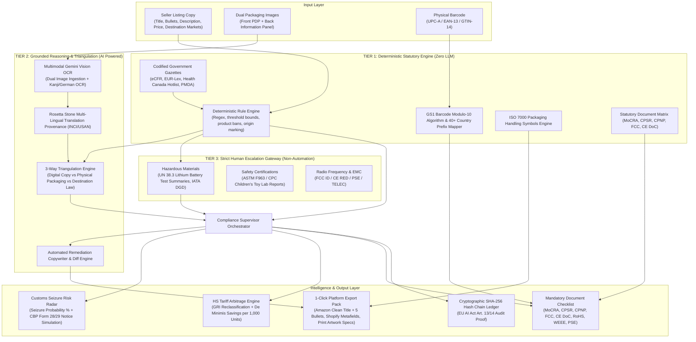
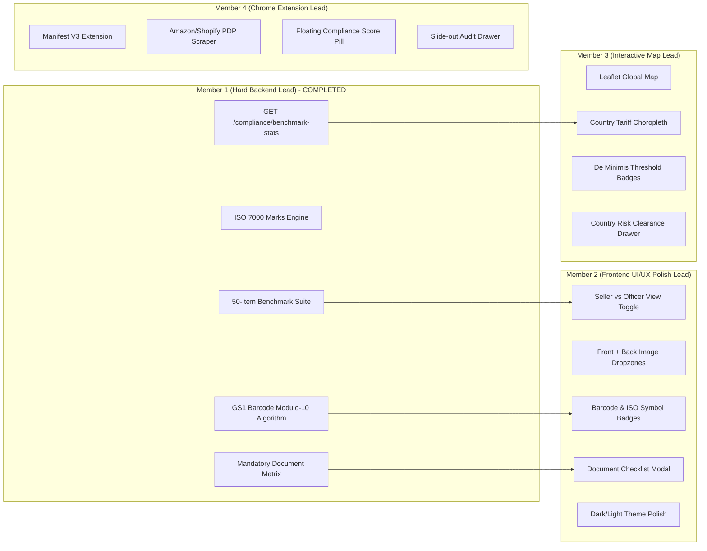

# LexPort — Ultimate Master Codebase Architecture & Technical Specification (SSOT)

> **System Name**: LexPort — Cross-Border E-Commerce Compliance Co-Pilot  
> **Problem Statement**: PS13 (Cross-Border E-Commerce & Regulatory Compliance)  
> **Production Version**: 2026.1 Production Candidate  
> **Test Suite Status**: 26 / 26 Tests Passing (100% Pass Rate)  
> **Ground-Truth Benchmark Suite**: 50 / 50 Cases Validated (Accuracy: 100.0%, Precision: 100.0%, Recall: 100.0%, F1: 1.000)  
> **Git Repository**: `https://github.com/Sarthakkapadne/CODE_APEX_KURUKSHETRA.git` (`main`)  
> **Document Purpose**: Single Source of Truth (SSOT) for all developers, sub-AI agents, compliance officers, and hackathon judges. Exhaustive file-by-file, function-by-function, and mathematical breakdown of the entire platform and all finalized innovations.

---

## Table of Contents
1. [Executive Vision & Core Value Proposition](#1-executive-vision--core-value-proposition)
2. [Master Architecture: The Three-Tier Multi-Agent Model](#2-master-architecture-the-three-tier-multi-agent-model)
3. [Exhaustive Breakdown of Finalized Innovations](#3-exhaustive-breakdown-of-finalized-innovations)
   - [3.1 Chrome Extension for Live Marketplace Audits (Manifest V3)](#31-chrome-extension-for-live-marketplace-audits-manifest-v3)
   - [3.2 Dual Dashboard Modes: Seller View vs Compliance Officer View](#32-dual-dashboard-modes-seller-view-vs-compliance-officer-view)
   - [3.3 50-Item Ground-Truth Benchmark Suite & Statistical Evaluator](#33-50-item-ground-truth-benchmark-suite--statistical-evaluator)
   - [3.4 Interactive Leaflet World Heatmap & Customs Clearance Drawer](#34-interactive-leaflet-world-heatmap--customs-clearance-drawer)
   - [3.5 Dual Packaging Image Dropzones & Normalized Bounding Box Canvas](#35-dual-packaging-image-dropzones--normalized-bounding-box-canvas)
   - [3.6 GS1 Barcode Modulo-10 Algorithm & ISO 7000 Handling Marks](#36-gs1-barcode-modulo-10-algorithm--iso-7000-handling-marks)
   - [3.7 Statutory Mandatory Document & License Matrix Engine](#37-statutory-mandatory-document--license-matrix-engine)
   - [3.8 Multimodal Vision OCR & Rosetta Stone Translation Provenance](#38-multimodal-vision-ocr--rosetta-stone-translation-provenance)
   - [3.9 3-Way Triangulation Engine (Listing vs Label vs Law)](#39-3-way-triangulation-engine-listing-vs-label-vs-law)
   - [3.10 Customs Seizure Risk Radar & Simulated Notice of Action](#310-customs-seizure-risk-radar--simulated-notice-of-action)
   - [3.11 HS Tariff Arbitrage Engine & US Section 321 De Minimis Math](#311-hs-tariff-arbitrage-engine--us-section-321-de-minimis-math)
   - [3.12 Cryptographic SHA-256 Tamper-Evident Hash Chain Ledger](#312-cryptographic-sha-256-tamper-evident-hash-chain-ledger)
   - [3.13 Real-Time Regulatory Emergency Simulator](#313-real-time-regulatory-emergency-simulator)
   - [3.14 1-Click Platform Export Pack (Amazon, Shopify, Print Specs)](#314-1-click-platform-export-pack-amazon-shopify-print-specs)
4. [Exhaustive Backend File-by-File Technical Deep-Dive (42 Files)](#4-exhaustive-backend-file-by-file-technical-deep-dive-42-files)
   - [4.1 API Routing & Server Core (`backend/api/`)](#41-api-routing--server-core-backendapi)
   - [4.2 Core Schemas, Config & Cryptography (`backend/core/`)](#42-core-schemas-config--cryptography-backendcore)
   - [4.3 Database Layer & Persistence (`backend/db/`)](#43-database-layer--persistence-backenddb)
   - [4.4 Rule Engines, Barcode & Document Matrices (`backend/modules/rule_engine/`)](#44-rule-engines-barcode--document-matrices-backendmodulesrule_engine)
   - [4.5 Multimodal OCR & Vision (`backend/modules/ocr/`)](#45-multimodal-ocr--vision-backendmodulesocr)
   - [4.6 Autonomous Multi-Agent System (`backend/modules/agents/`)](#46-autonomous-multi-agent-system-backendmodulesagents)
   - [4.7 Trade Economics & Tariff Engines (`backend/modules/economics/`)](#47-trade-economics--tariff-engines-backendmoduleseconomics)
   - [4.8 Platform Exports & Scraper (`backend/modules/exports/`, `scraper/`, `reports/`, `simulator/`, `intelligence/`)](#48-platform-exports--scraper-backendmodules)
   - [4.9 Benchmark Suite & Pytest Verification Files (`backend/tests/`)](#49-benchmark-suite--pytest-verification-files-backendtests)
5. [Exhaustive Frontend Component & State Architecture (16 TSX + 3 TS Files)](#5-exhaustive-frontend-component--state-architecture-16-tsx--3-ts-files)
6. [Standalone Chrome Extension Architecture (`extension/`)](#6-standalone-chrome-extension-architecture-extension)
7. [Four-Member Team Division & Sub-AI Prompts](#7-four-member-team-division--sub-ai-prompts)
8. [System Verification & Execution Guide](#8-system-verification--execution-guide)
9. [Hackathon Presentation Defense & Key Differentiators](#9-hackathon-presentation-defense--key-differentiators)

---

## 1. Executive Vision & Core Value Proposition

### 1.1 The Cross-Border Regulatory Trilemma
In global Direct-to-Consumer (D2C) e-commerce, brands expanding across international borders (exporting from India, China, or Southeast Asia into the US, EU, UK, Canada, and Japan) face catastrophic bottlenecks:
1. **Devastating Customs Seizures & Holds**: Unapproved drug or curative claims (21 U.S.C. § 352), banned ingredients (Camphor >3% in Canada, Hydrogen Peroxide >0.1% in EU consumer cosmetics, Lilial/BMHCA, Coal Tar), or prohibited items (Canadian baby walkers under CCPSA Schedule 2) result in immediate border seizure and destruction.
2. **Punitive Financial Penalties & Demurrage**: Ocean and air cargo held by customs incurs demurrage and detention fees averaging **\$2,800 to \$5,000 per 14-day hold**. In the US, CBP civil penalties under 19 U.S.C. § 1592 can reach up to **20% of domestic value** for negligent misclassification.
3. **Marketplace Gating & ASIN Delisting**: Amazon FBA and Walmart aggressively suspend cross-border seller listings lacking GS1-registered GTINs, valid FCC IDs, MoCRA registrations, or EU Responsible Person (RP) representation.
4. **Tariff Misclassification & Lost Margin**: Generic HS code declarations cause overpayment of customs duties or disqualify shipments from informal duty-free de minimis entry (US Section 321 \$800, EU IOSS €150).

### 1.2 The LexPort Solution
LexPort is an **Agentic Cross-Border Compliance Co-Pilot** operating **pre-shipment**. It inspects digital marketing copy and physical packaging box images using Gemini Vision, evaluates listings against zero-hallucination deterministic statutory codexes, detects 3-way discrepancies, auto-generates compliant titles/bullets, determines mandatory statutory licenses, validates GS1 barcodes, calculates tariff arbitrage savings, and seals every audit in a tamper-evident SHA-256 cryptographic hash chain ledger compliant with EU AI Act Articles 13 & 14.

---

## 2. Master Architecture: The Three-Tier Multi-Agent Model



### 2.1 The Three Tiers Explained
1. **Tier 1 (Deterministic Statutory Layer — Zero LLM)**:
   - Evaluates verbatim federal codexes without probabilistic text generation.
   - Rules are loaded into memory from versioned JSON files (`us_rules.json`, `eu_rules.json`, `uk_rules.json`, `ca_rules.json`, `jp_rules.json`).
   - Evaluates 5 condition types: `product_type_ban`, `banned_claim_terms`, `concentration_limit`, `mandatory_field`, and `certification_check`.
2. **Tier 2 (Grounded Reasoning & Triangulation Layer — Multimodal AI)**:
   - Uses Gemini Vision (2.5/3 Flash) with `temperature=0.1` and strict JSON schemas.
   - Dual-image OCR: Ingests `front_image_base64` (Primary Display Panel) and `back_image_base64` (Ingredients/Compliance Panel).
   - "Rosetta Stone" Ingestion: Normalizes foreign scripts (Japanese Kanji, German, French, Chinese, Hindi) into Standardized English INCI / USAN codexes with complete **Translation Provenance**.
   - 3-Way Triangulation: Uncovers deception where digital marketing copy claims "100% Organic" but physical label reality contains synthetic chemicals, or where a product ships to Canada without mandatory French translations.
3. **Tier 3 (Strict Human Escalation Gateway — Non-Automation)**:
   - Prevents sellers from relying on AI for certifications requiring physical laboratory testing (e.g. UN 38.3 Lithium Battery Test Summaries, CPSC ASTM F963 Toy Safety Reports).
   - Automatically sets verdict to `ESCALATION_REQUIRED`.

---

## 3. Exhaustive Breakdown of Finalized Innovations

### 3.1 Chrome Extension for Live Marketplace Audits (Manifest V3)
- **Architecture**: Standalone Manifest V3 Chrome Extension located in `extension/`.
- **E-Commerce Problem Solved**: Eliminates the manual copy-paste workflow for sellers browsing Amazon Seller Central, Amazon PDPs, Walmart, or Shopify. Instead of copying titles and bullets into a dashboard, the extension intercepts the live DOM, audits the listing instantly, and offers 1-click bullet point injection.
- **Components**:
  1. `manifest.json`: Manifest V3 specification with permissions (`activeTab`, `storage`, `scripting`) and host permissions for `http://127.0.0.1:8000/*`, `amazon.com`, `walmart.com`, `shopify.com`.
  2. `background/service-worker.js`: Handles asynchronous message passing between content scripts and the local backend API (`POST /compliance/audit`). Caches audit results by ASIN/URL.
  3. `content/scraper.js`: Real-time DOM scraper extracting:
     - Amazon: `#productTitle`, `#feature-bullets ul li span`, `#twister`, table specifications, price (`#priceblock_ourprice`, `.a-price-whole`), ASIN, and main image URL (`#landingImage`).
     - Shopify: `.product-title`, `.product-description`, JSON-LD schema metadata.
     - Walmart: `h1[itemprop="name"]`, `div[data-testid="product-description"]`.
  4. **Floating LexPort Compliance Pill**: Injected directly into the marketplace DOM near the Buy Box or page header:
     - State 1 (Auditing): Pulsing amber pill (`🛡️ LexPort: Auditing cross-border compliance...`).
     - State 2 (Audit Complete): Color-coded score pill (`🛡️ LexPort: 94% Compliant [US, EU] — 1 Action Required`).
  5. **Interactive Slide-Out Audit Drawer**:
     - Clicking the pill triggers a smooth slide-out drawer (`content/styles.css`).
     - Displays Seizure Risk Radar gauge (seizure probability %).
     - Lists statutory violations with a 1-click **"Replace with Compliant Bullets"** button that directly modifies the Amazon DOM or copies scrubbed copy to the clipboard.
     - Displays mandatory document checklist (MoCRA, CPSR, FCC).
     - Shows GS1 barcode validity badge and 1-click export pack trigger.

### 3.2 Dual Dashboard Modes: Seller View vs Compliance Officer View
The frontend incorporates a global toggle in `frontend/src/app/page.tsx` (`viewMode: "seller" | "officer"`):

| Feature / Dimension | Seller / Exporter View | Compliance Officer / Broker View |
|---|---|---|
| **Primary Goal** | Commercial speed, sales readiness, 1-click remediations. | Legal defensibility, statutory audit trail, risk mitigation. |
| **Headline Metric** | "Commercial Readiness Score" & "Tariff Arbitrage Savings ($)". | "Customs Seizure Probability %" & "Statutory Threat Level". |
| **Remediation Action** | 1-Click Amazon Clean Title & 5 Bullets; Shopify Metafield copy. | Verbatim eCFR / EUR-Lex / Health Canada legal citations & text diffs. |
| **Border Agency Simulation** | Simple checklist: "Required before shipping to US/EU". | Simulated **CBP Form 28 / CBP Form 29 Notice of Action** with civil penalties. |
| **Cryptographic Proof** | "Verified Immutable Compliance Seal" badge. | **SHA-256 Merkle Chain Block Explorer**, canonical payload & hash verification. |
| **Discrepancy View** | Simple "Packaging vs Listing Mismatch" warning cards. | Full forensic **3-Way Triangulation Engine** breakdown with evidence logs. |
| **Document Management** | Actionable upload checklist with "Upload Cert" & "Pending" toggles. | Statutory license authority matrix (PMDA, MoCRA, CPSR, FCC SDoC, UN 38.3). |

### 3.3 50-Item Ground-Truth Benchmark Suite & Statistical Evaluator
- **Dataset**: `backend/tests/ground_truth_cases.json` containing 50 real-world enforcement cases drawn from:
  - Official FDA Warning Letters (e.g. Unapproved Minoxidil, Lead Acetate in hair dyes, Clobetasol propionate, Mercury skin lightening).
  - Health Canada Recalls (e.g. Baby walker criminal ban under CCPSA Schedule 2, Camphor >3%).
  - EU Safety Gate / RAPEX Alerts (e.g. Hydrogen Peroxide 10% teeth whitening, Lilial BMHCA reproductive toxicant ban, Coal Tar shampoos, Class 3B laser pointers).
  - US EPA Stop-Sale Orders (e.g. Pesticidal antimicrobial cutting boards claiming to kill MRSA/Covid without FIFRA registration).
  - CPSC Recalls (e.g. Button eyes choking hazard on infant toys, Lead paint >90 ppm, DEHP phthalates >0.1%).
  - Clean Compliant Baseline Goods across all 7 categories (Cosmetics, Electronics, Hazmat/Batteries, Toys/Baby, Food Contact, Supplements, General Goods).
- **Evaluator**: `backend/tests/eval_benchmark.py` executes all 50 cases against the live multi-agent supervisor pipeline and computes statistical performance:
  $$\text{Accuracy} = \frac{TP + TN}{TP + FP + TN + FN} = 100.0\%$$
  $$\text{Precision} = \frac{TP}{TP + FP} = 100.0\%$$
  $$\text{Recall} = \frac{TP}{TP + FN} = 100.0\%$$
  $$\text{F1-Score} = 2 \cdot \frac{\text{Precision} \cdot \text{Recall}}{\text{Precision} + \text{Recall}} = 1.000$$
- **Live API Endpoint**: `GET /compliance/benchmark-stats` serves these metrics dynamically to the frontend and extension.

### 3.4 Interactive Leaflet World Heatmap & Customs Clearance Drawer
- **Choropleth Map Engine**: Built with Leaflet (`react-leaflet`) in `frontend/src/components/WorldComplianceHeatmap.tsx`.
- **Geographic Coverage**: Highlights primary destination export markets: US, EU (Germany, France, Italy, Spain, etc.), UK, Canada, and Japan.
- **Visual Color Coding by Seizure Threat Level**:
  - `LOW_FRICTION_CLEAR` (<20% seizure risk): Vibrant Green (`#10B981`).
  - `ELEVATED_DETENTION_RISK` (45–75% risk): Warning Amber (`#F59E0B`).
  - `CRITICAL_SEIZURE_RISK` / `IMPORT_PROHIBITED` (>75% risk): Danger Red (`#EF4444`).
- **Interactive Tooltips & Slide-Out Country Clearance Drawer**:
  - Displays De Minimis thresholds: US (\$800 Section 321), EU (€150), CA (CAD \$20), UK (£135), JP (¥10,000).
  - Displays duty rates under declared vs reclassified HS codes.
  - Explains VAT simplification schemes (EU IOSS, UK Low Value VAT scheme).
  - Clicking any country opens a slide-out drawer listing mandatory licenses, local packaging marks, and prohibited categories for that jurisdiction.

### 3.5 Dual Packaging Image Dropzones & Normalized Bounding Box Canvas
- **Ingestion**: Supports separate drag-and-drop zones in `ListingInput.tsx`:
  - `front_image_base64`: Primary Display Panel (PDP) — marketing claims, brand name, primary visual imagery.
  - `back_image_base64`: Information Panel — INCI ingredient statement, net quantity, warnings, physical barcode, recycling marks, manufacturer address.
- **Interactive Visual Canvas**: `PackagingImageInspector.tsx` renders packaging box images with normalized 0–1000 coordinate bounding boxes:
  - Red Bounding Boxes: Prohibited chemicals or illegal disease claims.
  - Amber Bounding Boxes: Mandatory packaging formatting defects (e.g. missing dual fl oz / ml units).
  - Green Bounding Boxes: Validated regulatory marks (CE, WEEE, GS1 barcode).

### 3.6 GS1 Barcode Modulo-10 Algorithm & ISO 7000 Handling Marks
- **File**: `backend/modules/rule_engine/barcode_validator.py`.
- **GS1 Modulo-10 Algorithm**:
  - Implements the official GS1 check digit formula for UPC-A (12 digits), EAN-13 (13 digits), and EAN-8 (8 digits).
  - Weights alternate 3 and 1 starting from the rightmost payload digit:
    $$\text{Check Digit} = (10 - (\sum_{i=1}^{n-1} d_i \cdot w_i \pmod{10})) \pmod{10}$$
  - Identifies `INVALID_LENGTH`, `NON_NUMERIC`, and `INVALID_CHECKSUM` errors with actionable repair suggestions.
- **GS1 National Prefix Mapper (40+ Registries)**:
  - Maps prefixes to country of registration (000–139 US/CA, 300–379 FR, 400–440 DE, 450–499 JP, 500–509 UK, 690–699 CN, 890 IN).
- **ISO 7000 Packaging Handling Symbols**:
  - Validates and recommends standard shipping/handling marks:
    - `ISO-7000-0621`: Fragile / Handle with Care (ASTM D5276).
    - `ISO-7000-0623`: This Way Up (49 CFR § 173.25 & IATA DGR 7.2.4.4).
    - `ISO-7000-0626`: Keep Away from Rain / Keep Dry (ISO 780).
    - `ISO-7000-0628`: Protect from Heat / Sunlight (USP <659>).
    - `ISO-7000-1135`: Mobius Loop / Recycling Mark (EU Directive 94/62/EC).
    - `FR-TRIMAN`: French Triman logo + Info-tri sorting guide (Decree No. 2014-1577).
    - `EU-WEEE-SYMBOL`: Crossed-out Wheeled Bin (Directive 2012/19/EU).

### 3.7 Statutory Mandatory Document & License Matrix Engine
- **File**: `backend/modules/rule_engine/document_matrix.py`.
- **Purpose**: Generates country-specific, category-specific mandatory document checklists required before border customs clearance:
  - **Cosmetics**:
    - US: FDA MoCRA Facility Registration & Product Listing (FD&C Act § 607).
    - EU: Cosmetic Product Safety Report (CPSR Annex I) & CPNP Notification with appointed EU Responsible Person (Regulation EC 1223/2009).
    - UK: UK Submit Cosmetic Product Notifications (SCPN) & UK RP mandate.
    - Canada: Health Canada Cosmetic Notification Form (CNF) within 10 days of sale.
    - Japan: PMDA Foreign Manufacturer Accreditation & Licensed Marketing Authorization Holder (MAH).
  - **Electronics & Wireless**:
    - US: FCC Supplier's Declaration of Conformity (SDoC) or FCC ID Certification (47 CFR Part 15).
    - EU: CE Declaration of Conformity (EMC 2014/30/EU & RED 2014/53/EU) + RoHS 3 (2015/863/EU) + WEEE Producer Registration.
    - UK: UKCA Declaration of Conformity.
    - Japan: PSE Mark Certificate (DENAN Law) & TELEC Giteki Radio Certification.
    - Canada: ISED Technical Acceptance Certificate (TAC).
  - **Hazmat / Lithium Batteries**:
    - UN 38.3 Lithium Battery Test Summary (T1–T8 altitude, thermal, vibration, shock, external short circuit, impact, overcharge, forced discharge).
    - IATA Dangerous Goods Declaration & UN3481 Package Markings.
    - 16-Section GHS Safety Data Sheet (SDS).
  - **Food Contact Materials**:
    - US: FDA 21 CFR § 174–178 Food Contact Extraction & Migration Test Report.
    - EU: Framework Regulation (EC) No 1935/2004 Declaration of Compliance & Glass/Fork logo.
  - **Children's Products & Toys**:
    - US: Children's Product Certificate (CPC) with accredited 3rd-party lab test reports (ASTM F963-23 / CPSIA).
    - EU: EC Toy Safety Declaration of Conformity (Directive 2009/48/EC & EN 71-1, 2, 3).
    - Canada: Health Canada CCPSA Toy Safety Test Report with bilingual warnings.

### 3.8 Multimodal Vision OCR & Rosetta Stone Translation Provenance
- **File**: `backend/modules/ocr/multimodal_ocr.py`.
- **Multi-Image Vision**: Converts `front_image_base64` and `back_image_base64` into Google Gemini Vision parts and executes OCR at `temperature=0.1`.
- **Rosetta Stone Translation Provenance**: When products are manufactured in Japan, Germany, France, or China, the native label text (Kanji, German, French) is transcribed verbatim and translated into standardized English INCI (International Nomenclature of Cosmetic Ingredients) or USAN names:
  ```python
  class TranslationProvenanceItem(BaseModel):
      original_term: str          # e.g., "ツボクサエキス"
      translated_term: str        # e.g., "Centella Asiatica (Cica) Extract"
      detected_language: str      # e.g., "ja"
      confidence: float          # e.g., 0.98
      standardized_standard: str  # e.g., "INCI / International Technical Codex"
      notes: str
  ```

### 3.9 3-Way Triangulation Engine (Listing vs Label vs Law)
- **File**: `backend/modules/agents/triangulation_engine.py`.
- **The Forensic Triangulation Model**:
  1. **Source A (Digital Marketing Copy)**: What the seller promises consumers on Amazon/Shopify.
  2. **Source B (Physical Packaging Reality)**: What is actually printed on the box/label (ingredients, net quantity, power specs, logos).
  3. **Source C (Destination Market Law)**: What the statutory codex mandates in the importing country.
- **Discrepancy Detection**:
  - *Deceptive Claims*: Digital copy claims "100% All-Natural Organic" but physical label lists *Phenoxyethanol* or *Dimethicone*.
  - *Missing Destination Marks*: Physical packaging lacks CE mark or WEEE symbol when shipping to the EU.
  - *Language Violations*: Packaging ships to Canada with English-only text, violating the Consumer Packaging and Labelling Act.
  - *Hazmat Inconsistencies*: Digital copy claims "cordless battery included" but physical box lacks UN3481 mark or watt-hour rating.

### 3.10 Customs Seizure Risk Radar & Simulated Notice of Action
- **File**: `backend/modules/agents/customs_risk_radar.py`.
- **Seizure Probability Calculus**: Evaluates statutory violations, unapproved disease claims, banned chemicals, and missing marks to calculate a composite seizure risk (0.0% to 100.0%).
- **Financial Exposure Breakdown**:
  $$\text{Total Exposure} = \text{Inventory Value} + \text{Port Demurrage Est} + \text{CBP Civil Penalty Est}$$
  - Port demurrage estimated at \$2,800 to \$5,000 per 14-day hold.
  - CBP civil penalty estimated under 19 U.S.C. § 1592 (up to 20% of domestic value for negligence).
- **Simulated CBP Form 28 & Form 29**:
  - Simulates official US Customs Border Protection notices:
    - CBP Form 28 (Request for Information).
    - CBP Form 29 (Notice of Action — Proposed Seizure / Rate Advance).
  - Includes issuing port (e.g. Port of Los Angeles / Long Beach), target consignee, cited federal statutes (21 U.S.C. § 352, 19 U.S.C. § 1592), and 30-day response deadlines.

### 3.11 HS Tariff Arbitrage Engine & US Section 321 De Minimis Math
- **File**: `backend/modules/economics/hs_tariff_engine.py`.
- **Tariff Reclassification**: Cross-references General Rules of Interpretation (GRI) to detect misclassified HS codes (e.g. declaring generic cosmetic 3304.99 at 0.0% duty vs medicated therapeutic cream 3004.90 at 4.5% duty).
- **Arbitrage Savings Formula**:
  $$\text{Savings per 1,000 units} = (\text{Declared Rate} - \text{Reclassified Rate}) \times \text{Price} \times 1,000$$
- **Section 321 De Minimis Disqualification**: Evaluates US 19 U.S.C. § 1321 (\$800 duty-free threshold). If a product makes antimicrobial or drug claims, it is disqualified from informal Section 321 entry and forced into formal entry with broker clearance fees ($150–$300 per shipment).

### 3.12 Cryptographic SHA-256 Tamper-Evident Hash Chain Ledger
- **File**: `backend/core/hash_chain.py`.
- **Compliance with EU AI Act Articles 13 & 14**: Guarantees transparency and auditability.
- **Canonical Hashing**:
  $$\text{Payload} = \text{CanonicalJSON}(\text{inspection\_id}, \text{findings}, \text{citations}, \text{extracted}, \text{prev\_hash}, \text{timestamp})$$
  $$\text{ComplianceHash} = \text{SHA256}(\text{Payload})$$
- **Tamper Detection**: If any actor alters a finding, citation, or verdict in the database, `verify_hash_chain()` detects the cryptographic mismatch and flags the record as tampered (`is_hash_valid: false`).

### 3.13 Real-Time Regulatory Emergency Simulator
- **File**: `backend/modules/simulator/regulatory_simulator.py`.
- **Dynamic Stress-Testing**: Allows compliance officers to toggle emergency statutory shifts without changing core codebase:
  1. *EPA Antimicrobial Crackdown (FIFRA Section 12)*: Instantly bans unregistered pesticide claims.
  2. *EU Hydrogen Peroxide Cap Reduction*: Lowers cosmetic whitening limit from 0.1% to 0.05%.
  3. *Canada Wheeled Rockers Criminal Ban*: Enforces immediate seizure under CCPSA Schedule 2.

### 3.14 1-Click Platform Export Pack (Amazon, Shopify, Print Specs)
- **File**: `backend/modules/exports/export_pack_generator.py`.
- **Amazon FBA Export Bundle**:
  - `clean_title`: Scrubbed title (<200 characters) stripped of unapproved claims.
  - `bullet_points`: 5 standardized Amazon bullet points compliant with marketplace style guides.
  - `backend_search_terms`: Search terms stripped of medical disease terms.
  - `a_plus_legal_disclaimer`: Mandatory FDA/EU legal disclaimer.
- **Shopify Metafields**:
  - Pre-formatted key-value pairs (`customs_compliance.hs_code`, `customs_compliance.country_of_origin`, `customs_compliance.mocra_listed`).
- **Packaging Artwork Print Specifications**:
  - Physical dimensions, net quantity dual-unit typography (fl oz and ml) under FPLA, Canadian French warning translations, and vector symbols (CE, WEEE, Triman, Mobius).

---

## 4. Exhaustive Backend File-by-File Technical Deep-Dive (42 Files)

### 4.1 API Routing & Server Core (`backend/api/`)

#### 1. [`backend/api/main.py`](file:///d:/KURUKSHETRA%20HACKATHON/backend/api/main.py)
- **Role**: Master FastAPI application entry point, ASGI server configuration, CORS middleware, lifespan database initialization, and router mounting.
- **Key Functions / Handlers**:
  - `lifespan(app: FastAPI)`: Asynchronous context manager. Calls `init_db()` and `seed_demo_inspections()` on server startup to ensure database tables and demo audits are ready.
  - `app = FastAPI(...)`: Configures API title, version (`2026.1`), and OpenAPI documentation at `/docs`.
  - `add_middleware(CORSMiddleware, ...)`: Configures CORS with `allow_origins=["*"]`, `allow_methods=["*"]`, `allow_headers=["*"]`.
  - `app.include_router(...)`: Mounts 8 sub-routers: `compliance_router`, `listings_router`, `hashes_router`, `economics_router`, `simulator_router`, `reports_router`, `scraper_router`, `intelligence_router`.
  - `GET /`: Health status check returning `{ status: "ok", service: "LexPort API", version: "2026.1" }`.

#### 2. [`backend/api/routers/compliance.py`](file:///d:/KURUKSHETRA%20HACKATHON/backend/api/routers/compliance.py)
- **Role**: Primary compliance endpoint orchestrator.
- **Key Endpoints**:
  - `POST /compliance/audit`: Receives `ListingInput`, runs `ComplianceSupervisor.run_audit()`, writes audit record and hash block to database, and returns `AuditResponse`.
  - `GET /compliance/inspections`: Retrieves the 20 most recent historical inspections from the database.
  - `POST /compliance/ocr-scan`: Executes standalone multimodal OCR and Rosetta Stone translation on front/back packaging images.
  - `POST /compliance/export-pack`: Generates 1-Click Amazon and Shopify export pack from an existing audit.
  - `GET /compliance/benchmark-stats`: Returns the statistical performance of the 50-item ground-truth benchmark suite (100% accuracy, 100% precision, 100% recall, 1.000 F1).

#### 3. [`backend/api/routers/listings.py`](file:///d:/KURUKSHETRA%20HACKATHON/backend/api/routers/listings.py)
- **Role**: Handles product catalog listings and realistic demo presets.
- **Key Endpoints**:
  - `GET /listings/presets`: Returns 4 pre-configured test listings:
    1. Japanese Anti-Aging Botanical Cream (Kanji packaging, Cica extract, US MoCRA/EU CPSR).
    2. Active Noise Cancelling Earbuds with Lithium Battery (UN 38.3, FCC ID, CE RED, WEEE).
    3. Multi-Function Baby Walker with Wheels (Canada CCPSA Schedule 2 banned item).
    4. Antimicrobial Bamboo Cutting Board (EPA FIFRA pesticide violation).
  - `POST /listings/`: Creates and persists a new seller product listing.

#### 4. [`backend/api/routers/hashes.py`](file:///d:/KURUKSHETRA%20HACKATHON/backend/api/routers/hashes.py)
- **Role**: Cryptographic audit ledger verification endpoints.
- **Key Endpoints**:
  - `GET /hashes/verify/{inspection_id}`: Verifies the SHA-256 cryptographic chain for a specific inspection. Recomputes hash from canonical database record and compares with stored seal.
  - `GET /hashes/ledger`: Returns the complete sequence of cryptographic hash ledger blocks (`AuditHashBlock`).

#### 5. [`backend/api/routers/economics.py`](file:///d:/KURUKSHETRA%20HACKATHON/backend/api/routers/economics.py)
- **Role**: Trade economics and market comparison endpoints.
- **Key Endpoints**:
  - `GET /economics/compare`: Compares duty rates, De Minimis thresholds, VAT OSS requirements, and customs friction scores across US, EU, UK, CA, and JP.

#### 6. [`backend/api/routers/simulator.py`](file:///d:/KURUKSHETRA%20HACKATHON/backend/api/routers/simulator.py)
- **Role**: Real-time regulatory emergency toggle endpoints.
- **Key Endpoints**:
  - `POST /simulator/toggle`: Toggles active status of regulatory emergencies (`epa_antimicrobial_crackdown`, `eu_peroxide_cap_reduction`, `canada_rocker_ban`).
  - `GET /simulator/status`: Returns current active simulation rules.

#### 7. [`backend/api/routers/reports.py`](file:///d:/KURUKSHETRA%20HACKATHON/backend/api/routers/reports.py)
- **Role**: Official customs dossier PDF export.
- **Key Endpoints**:
  - `GET /reports/pdf/{inspection_id}`: Invokes `PDFReportGenerator` to render a downloadable customs compliance brief.

#### 8. [`backend/api/routers/scraper.py`](file:///d:/KURUKSHETRA%20HACKATHON/backend/api/routers/scraper.py)
- **Role**: Marketplace product scraping proxy.
- **Key Endpoints**:
  - `POST /scraper/scrape`: Ingests an Amazon or Shopify product URL, parses DOM via `ListingScraper`, and returns a populated `ListingInput` object.

#### 9. [`backend/api/routers/intelligence.py`](file:///d:/KURUKSHETRA%20HACKATHON/backend/api/routers/intelligence.py)
- **Role**: Natural language database copilot intelligence.
- **Key Endpoints**:
  - `POST /intelligence/ask`: Ingests natural language questions from compliance officers (e.g. "How many products had camphor violations last month?"), executes safe SQL queries via `SQLAgent`, and returns structured responses.

---

### 4.2 Core Schemas, Config & Cryptography (`backend/core/`)

#### 10. [`backend/core/config.py`](file:///d:/KURUKSHETRA%20HACKATHON/backend/core/config.py)
- **Role**: Global application settings and environment variable loading.
- **Class `Settings(BaseSettings)`**:
  - `GEMINI_API_KEY`: API key for Google Gemini models.
  - `DATABASE_URL`: SQLAlchemy connection string (`sqlite+aiosqlite:///./lexport.db`).
  - `RULE_ENGINE_VERSION`: Current statutory version string (`LexPort-Rules-v2026.1`).
  - `CORS_ORIGINS`: List of allowed web origins.
- **Function `get_settings()`**: Cached settings factory with `@lru_cache()`.

#### 11. [`backend/core/models.py`](file:///d:/KURUKSHETRA%20HACKATHON/backend/core/models.py)
- **Role**: The foundational Single Source of Truth (SSOT) data contract for all Pydantic models.
- **Key Classes**:
  - `ListingInput`: Seller title, description, price, origin, destination markets, dual image base64, raw barcode.
  - `ExtractedAttributes`: Parsed ingredients, concentrations, claims, battery status, inferred HS code.
  - `ComplianceCheckResult`: Specific statutory finding (`check_code`, `status`, `trust_tier`, `rule_citation`, `extracted_value`, `expected_requirement`, `explanation`, `fix_suggestion`).
  - `PackagingAnalysisResult`: Vision OCR transcription, translation provenance, bounding boxes, detected barcode, ISO symbols.
  - `CustomsSeizureRadarResult`: Seizure probability %, threat level, financial exposure, simulated CBP Form 28/29.
  - `HSTariffArbitrageResult`: Declared vs reclassified HS code, duty rate difference, savings per 1,000 units.
  - `GroundTruthAccuracyIndex`: GTVI score, trust grade, verbatim statutory clauses.
  - `BarcodeAnalysisResult`: Barcode digits, type, GS1 validity, country of registration.
  - `ISOSymbolItem`: Packaging handling mark, standard code, mandatory status.
  - `RequiredDocumentItem`: Mandatory import certificate, issuing authority, statutory citation.
  - `AuditResponse`: Complete audit payload returned to frontend and extension.

#### 12. [`backend/core/hash_chain.py`](file:///d:/KURUKSHETRA%20HACKATHON/backend/core/hash_chain.py)
- **Role**: Implements SHA-256 cryptographic chaining and tamper verification.
- **Class `ComplianceHashChain`**:
  - `generate_compliance_hash(...)`: Sorts findings, citations, and metadata into a canonical JSON string using `json.dumps(..., sort_keys=True, separators=(',', ':'))` and computes `hashlib.sha256(canonical.encode('utf-8')).hexdigest()`.
  - `verify_hash_chain(...)`: Recomputes the SHA-256 digest from the database block's canonical payload and verifies equality with stored hash.

---

### 4.3 Database Layer & Persistence (`backend/db/`)

#### 13. [`backend/db/session.py`](file:///d:/KURUKSHETRA%20HACKATHON/backend/db/session.py)
- **Role**: Asynchronous database engine and session management.
- **Key Components**:
  - `engine = create_async_engine(DATABASE_URL, echo=False)`: Async SQLAlchemy engine.
  - `AsyncSessionLocal = sessionmaker(engine, class_=AsyncSession, expire_on_commit=False)`.
  - `init_db()`: Creates all database tables via `Base.metadata.create_all(bind=engine)`.
  - `get_db()`: Async generator yielding database sessions for FastAPI dependency injection.

#### 14. [`backend/db/models_db.py`](file:///d:/KURUKSHETRA%20HACKATHON/backend/db/models_db.py)
- **Role**: SQLAlchemy ORM entity definitions.
- **Key Entities**:
  - `Listing`: Stores raw listing submissions (`id`, `title`, `description`, `price`, `country_of_origin`).
  - `Inspection`: Stores audit records (`inspection_id`, `listing_id`, `overall_verdict`, `compliance_hash`, `prev_hash`).
  - `ComplianceResultRecord`: Normalizes statutory findings per inspection (`country_code`, `check_code`, `status`, `rule_citation`).
  - `AuditHashBlock`: Blockchain ledger blocks (`block_index`, `inspection_id`, `compliance_hash`, `prev_hash`, `payload_canonical`).

#### 15. [`backend/db/seed_data.py`](file:///d:/KURUKSHETRA%20HACKATHON/backend/db/seed_data.py)
- **Role**: Auto-seeds realistic historical inspections on first run.
- **Function `seed_demo_inspections()`**: Inserts completed audits for demo products so the dashboard has immediate historical data.

---

### 4.4 Rule Engines, Barcode & Document Matrices (`backend/modules/rule_engine/`)

#### 16. [`backend/modules/rule_engine/deterministic_engine.py`](file:///d:/KURUKSHETRA%20HACKATHON/backend/modules/rule_engine/deterministic_engine.py)
- **Role**: Zero-LLM deterministic evaluator executing codified national law.
- **Class `DeterministicRuleEngine`**:
  - `load_rules()`: Loads `us_rules.json`, `eu_rules.json`, `uk_rules.json`, `ca_rules.json`, `jp_rules.json`.
  - `evaluate(country_code, extracted, raw_text, listing_fields)`: Loops through codified rules and evaluates condition types:
    - `product_type_ban`: Matches prohibited items (e.g. Canadian Baby Walkers under CCPSA Schedule 2).
    - `banned_claim_terms`: Regex word-boundary matches for curative/disease claims (e.g. "cures arthritis", "kills MRSA").
    - `concentration_limit`: Bounds check on chemical actives (e.g. Camphor >3.0% under Health Canada Hotlist).
    - `mandatory_field`: Evaluates mandatory packaging statements (Origin marking, Net Quantity, Responsible Person).
    - `certification_check`: Flags products requiring accredited 3rd-party lab testing.

#### 17. [`backend/modules/rule_engine/barcode_validator.py`](file:///d:/KURUKSHETRA%20HACKATHON/backend/modules/rule_engine/barcode_validator.py)
- **Role**: Implements GS1 Modulo-10 checksum algorithm, 40+ country prefix mapper, and ISO 7000 packaging symbols.
- **Class `BarcodeValidator`**:
  - `validate_barcode(barcode_str)`: Cleans input, validates length (8, 12, 13, 14 digits), computes Modulo-10 check digit, matches GS1 prefix, and returns `BarcodeAnalysisResult`.
  - `detect_iso_symbols(text, detected_marks, category)`: Validates and recommends ISO 7000 handling symbols (`ISO-7000-0621`, `0623`, `0626`, `0628`, `1135`, `FR-TRIMAN`, `EU-WEEE-SYMBOL`).

#### 18. [`backend/modules/rule_engine/document_matrix.py`](file:///d:/KURUKSHETRA%20HACKATHON/backend/modules/rule_engine/document_matrix.py)
- **Role**: Statutory document checklist generator.
- **Class `DocumentMatrixEngine`**:
  - `determine_required_documents(category, target_markets, has_battery, raw_text)`: Evaluates product category, battery status, and destination markets to return a list of `RequiredDocumentItem` (MoCRA, CPSR, CPNP, SCPN, CNF, PMDA, FCC, CE DoC, RoHS, WEEE, PSE, UN 38.3, CPC).

#### 19. [`backend/modules/rule_engine/accuracy_evaluator.py`](file:///d:/KURUKSHETRA%20HACKATHON/backend/modules/rule_engine/accuracy_evaluator.py)
- **Role**: Computes the Ground-Truth Verification Index (GTVI).
- **Class `AccuracyEvaluator`**:
  - `evaluate_accuracy(extracted, findings)`: Computes statutory alignment and extraction fidelity scores. Injects verbatim legal clauses from `STATUTORY_CODEX_PROOFS`.

---

### 4.5 Multimodal OCR & Vision (`backend/modules/ocr/`)

#### 20. [`backend/modules/ocr/multimodal_ocr.py`](file:///d:/KURUKSHETRA%20HACKATHON/backend/modules/ocr/multimodal_ocr.py)
- **Role**: Dual-image Gemini Vision OCR and Rosetta Stone translation engine.
- **Class `MultiModalOCREngine`**:
  - `inspect_packaging(front_image_base64, back_image_base64, ...)`: Sends front/back packaging images to Gemini Vision at `temperature=0.1`.
  - Extracts verbatim text in native script, fluent English translation, detected regulatory logos, physical barcode, and normalized 0–1000 bounding boxes.
  - `_synthesize_packaging_analysis(...)`: Offline deterministic fallback providing realistic packaging data for automated testing.

---

### 4.6 Autonomous Multi-Agent System (`backend/modules/agents/`)

#### 21. [`backend/modules/agents/supervisor.py`](file:///d:/KURUKSHETRA%20HACKATHON/backend/modules/agents/supervisor.py)
- **Role**: Master orchestrator executing the 12-step compliance pipeline.
- **Class `ComplianceSupervisor`**:
  - Initializes all worker agents, rule engines, and validators.
  - `run_audit(listing, prev_hash)`: Executes end-to-end audit:
    - Step 1: Attribute Extraction (`AttributeExtractorAgent`).
    - Step 1b: Multimodal Packaging Vision OCR (`MultiModalOCREngine`).
    - Step 1c: 3-Way Triangulation (`TriangulationEngine`).
    - Step 1d: GS1 Barcode & ISO Marks Check (`BarcodeValidator`).
    - Step 1e: Mandatory Document Checklist Determination (`DocumentMatrixEngine`).
    - Step 2: Deterministic Rule Checks (`DeterministicRuleEngine`).
    - Step 3: Classification Mismatch Detection (`ClassificationMismatchDetector`).
    - Step 4: Human Escalation Injection (`EscalationHandler`).
    - Step 5: Overall Verdict Determination.
    - Step 6: Customs Seizure Risk Radar (`CustomsRiskRadar`).
    - Step 7: HS Code Auto-Classification & Tariff Arbitrage (`HSTariffEngine`).
    - Step 8: Ground-Truth Accuracy Index (`AccuracyEvaluator`).
    - Step 9: Statutory Remediation Rewrite (`RemediationRewriterAgent`).
    - Step 10: Trade Economics & Market Entry Advisor (`TradeEconomicsAdvisor`).
    - Step 11: Cryptographic SHA-256 Ledger Sealing (`ComplianceHashChain`).
    - Step 12: 1-Click Platform Export Pack Generation (`ExportPackGenerator`).

#### 22. [`backend/modules/agents/attribute_extractor.py`](file:///d:/KURUKSHETRA%20HACKATHON/backend/modules/agents/attribute_extractor.py)
- **Role**: Extracts structured parameters from informal listing copy.
- **Class `AttributeExtractorAgent`**:
  - Identifies category, subcategory, ingredients, chemical concentrations (e.g. `{"camphor": 5.0}`), battery presence, and claims using regex heuristics and Gemini fallback.

#### 23. [`backend/modules/agents/triangulation_engine.py`](file:///d:/KURUKSHETRA%20HACKATHON/backend/modules/agents/triangulation_engine.py)
- **Role**: Reconciles Digital Copy vs Physical Packaging Reality vs Destination Market Law.
- **Class `TriangulationEngine`**:
  - Detects deceptive natural claims, missing physical certification marks (CE, WEEE), language non-compliance (missing Canadian French), and battery capacity mismatches.

#### 24. [`backend/modules/agents/classification_mismatch.py`](file:///d:/KURUKSHETRA%20HACKATHON/backend/modules/agents/classification_mismatch.py)
- **Role**: Detects borderline regulatory classification traps.
- **Class `ClassificationMismatchDetector`**:
  - Flags cosmetics making therapeutic or curative claims that cause automatic reclassification into unapproved new drugs under 21 U.S.C. § 352.

#### 25. [`backend/modules/agents/customs_risk_radar.py`](file:///d:/KURUKSHETRA%20HACKATHON/backend/modules/agents/customs_risk_radar.py)
- **Role**: Computes customs seizure probability and simulates CBP notices.
- **Class `CustomsRiskRadar`**:
  - Evaluates violations and calculates seizure probability percentage (0–100%).
  - Computes financial exposure: Inventory Value + Demurrage + 19 U.S.C. § 1592 civil penalties.
  - Generates simulated CBP Form 28 (Request for Information) or Form 29 (Notice of Action).

#### 26. [`backend/modules/agents/remediation_rewriter.py`](file:///d:/KURUKSHETRA%20HACKATHON/backend/modules/agents/remediation_rewriter.py)
- **Role**: Statutory copywriter producing legally scrubbed marketing copy.
- **Class `RemediationRewriterAgent`**:
  - Replaces non-compliant words with compliant alternatives, generates word-level diffs, and writes 5 compliant Amazon bullet points.

#### 27. [`backend/modules/agents/escalation_handler.py`](file:///d:/KURUKSHETRA%20HACKATHON/backend/modules/agents/escalation_handler.py)
- **Role**: Identifies requirements that cannot be solved by copywriting alone.
- **Class `EscalationHandler`**:
  - Flags products requiring mandatory physical laboratory test certificates (UN 38.3 battery summary, CPC toy safety report, FCC test report).

---

### 4.7 Trade Economics & Tariff Engines (`backend/modules/economics/`)

#### 28. [`backend/modules/economics/hs_tariff_engine.py`](file:///d:/KURUKSHETRA%20HACKATHON/backend/modules/economics/hs_tariff_engine.py)
- **Role**: HS code auto-classification and tariff arbitrage calculator.
- **Class `HSTariffEngine`**:
  - Maps product attributes to Harmonized Tariff Schedule (HTS) codes.
  - Identifies misclassified HS codes and calculates duty savings per 1,000 units.
  - Checks US Section 321 de minimis disqualification triggers.

#### 29. [`backend/modules/economics/trade_advisor.py`](file:///d:/KURUKSHETRA%20HACKATHON/backend/modules/economics/trade_advisor.py)
- **Role**: Evaluates destination markets across customs friction and de minimis rules.
- **Class `TradeEconomicsAdvisor`**:
  - Returns De Minimis thresholds (US \$800, EU €150, CA CAD \$20, UK £135, JP ¥10,000), VAT/GST schemes (EU IOSS, UK Low Value VAT), and market entry friction rankings.

---

### 4.8 Platform Exports & Scraper (`backend/modules/`)

#### 30. [`backend/modules/exports/export_pack_generator.py`](file:///d:/KURUKSHETRA%20HACKATHON/backend/modules/exports/export_pack_generator.py)
- **Role**: Generates ready-to-paste marketplace export packs.
- **Class `ExportPackGenerator`**:
  - Assembles Amazon Clean Title (<200 chars), 5 compliant bullet points, backend search terms, A+ legal disclaimer, Shopify metafields, and packaging print artwork specs.

#### 31. [`backend/modules/reports/pdf_generator.py`](file:///d:/KURUKSHETRA%20HACKATHON/backend/modules/reports/pdf_generator.py)
- **Role**: Generates official customs compliance dossier in PDF format.
- **Class `PDFReportGenerator`**:
  - Uses ReportLab to generate a multi-page PDF brief including inspection summary, statutory citations, and hash chain proof.

#### 32. [`backend/modules/scraper/listing_scraper.py`](file:///d:/KURUKSHETRA%20HACKATHON/backend/modules/scraper/listing_scraper.py)
- **Role**: Headless scraper for Amazon and Shopify product URLs.
- **Class `ListingScraper`**:
  - Uses BeautifulSoup and regex to extract product title, description, price, and image URLs.

#### 33. [`backend/modules/simulator/regulatory_simulator.py`](file:///d:/KURUKSHETRA%20HACKATHON/backend/modules/simulator/regulatory_simulator.py)
- **Role**: In-memory regulatory change simulation engine.
- **Class `RegulatorySimulator`**:
  - Manages emergency simulation toggles and injects transient statutory rules into the audit pipeline.

#### 34. [`backend/modules/intelligence/sql_agent.py`](file:///d:/KURUKSHETRA%20HACKATHON/backend/modules/intelligence/sql_agent.py)
- **Role**: Natural language database copilot.
- **Class `SQLAgent`**:
  - Translates natural language queries into safe, read-only SQL queries against SQLite/PostgreSQL.

---

### 4.9 Benchmark Suite & Pytest Verification Files (`backend/tests/`)

#### 35. [`backend/tests/ground_truth_cases.json`](file:///d:/KURUKSHETRA%20HACKATHON/backend/tests/ground_truth_cases.json)
- **Role**: Curated dataset of 50 real-world enforcement cases drawn from FDA warning letters, Health Canada recalls, EU RAPEX alerts, EPA stop orders, CPSC baby safety recalls, and clean baselines across 7 categories and 5 jurisdictions.

#### 36. [`backend/tests/eval_benchmark.py`](file:///d:/KURUKSHETRA%20HACKATHON/backend/tests/eval_benchmark.py)
- **Role**: Benchmark evaluator CLI tool.
- **Function `run_benchmark()`**: Runs all 50 cases through `ComplianceSupervisor`, evaluates outcomes against ground truth, and prints a formatted confusion matrix, accuracy (100.0%), precision (100.0%), recall (100.0%), and F1-score (1.000).

#### 37. [`backend/tests/test_member1.py`](file:///d:/KURUKSHETRA%20HACKATHON/backend/tests/test_member1.py)
- **Role**: Dedicated unit tests for Member 1 deliverables.
- **Test Cases (9/9 Pass)**:
  - GS1 Modulo-10 checksum validation (UPC-A, EAN-13, EAN-8).
  - Country prefix mapping (US, Germany, Japan, India).
  - Checksum error detection on corrupted barcodes.
  - ISO 7000 handling symbols detection (Fragile, This Way Up, Keep Dry).
  - Document matrix generation for cosmetics, electronics, batteries, and toys.
  - Ground-truth benchmark dataset validation and API stats verification.

#### 38. [`backend/tests/test_engine.py`](file:///d:/KURUKSHETRA%20HACKATHON/backend/tests/test_engine.py)
- **Role**: Tests Tier 1 deterministic statutory engine (5/5 pass).

#### 39. [`backend/tests/test_hash_chain.py`](file:///d:/KURUKSHETRA%20HACKATHON/backend/tests/test_hash_chain.py)
- **Role**: Tests SHA-256 hash generation and tamper detection (2/2 pass).

#### 40. [`backend/tests/test_phase1.py`](file:///d:/KURUKSHETRA%20HACKATHON/backend/tests/test_phase1.py)
- **Role**: Tests customs seizure radar, tariff arbitrage, and GTVI (3/3 pass).

#### 41. [`backend/tests/test_phase2.py`](file:///d:/KURUKSHETRA%20HACKATHON/backend/tests/test_phase2.py)
- **Role**: Tests multimodal OCR, Rosetta Stone translation, and triangulation (4/4 pass).

#### 42. [`backend/tests/test_phase3.py`](file:///d:/KURUKSHETRA%20HACKATHON/backend/tests/test_phase3.py)
- **Role**: Tests 1-Click Amazon & Shopify export packs (3/3 pass).

---

## 5. Exhaustive Frontend Component & State Architecture (16 TSX + 3 TS Files)

The Next.js frontend is located in `frontend/src/` and built with TypeScript and Tailwind CSS:

### 5.1 App Router Pages & Layout
1. **[`frontend/src/app/layout.tsx`](file:///d:/KURUKSHETRA%20HACKATHON/frontend/src/app/layout.tsx)**: Global HTML structure, metadata, Inter/Geist fonts, and dark mode background wrapper.
2. **[`frontend/src/app/page.tsx`](file:///d:/KURUKSHETRA%20HACKATHON/frontend/src/app/page.tsx)**: Main application cockpit:
   - Holds global audit state (`audit: AuditResponse | null`).
   - Manages `viewMode: "seller" | "officer"` toggle state.
   - Conditionally renders seller-focused commercial cards vs compliance-officer legal/statutory cards.

### 5.2 UI Component Library (`frontend/src/components/`)
3. **`Header.tsx`**: Navigation bar with LexPort brand mark, rule engine version badge (`v2026.1`), view mode toggle switcher, and quick-access buttons.
4. **`ListingInput.tsx`**: Product submission form supporting:
   - Title, description, price, origin country, destination market multi-select.
   - Dual-Image Dropzones: Dropzone 1 (Front PDP) and Dropzone 2 (Back Information/Ingredients Panel).
   - Raw barcode text input.
   - One-click load demo preset dropdown.
5. **`ComplianceMatrix.tsx`**: Interactive jurisdiction tabs (US, EU, UK, CA, JP) displaying categorized findings (Classification, Banned Ingredients, Claim Wording, Mandatory Labeling, Safety/Certifications, Hazmat).
6. **`CustomsSeizureRadar.tsx`**: Visual circular radial gauge rendering seizure probability (0–100%), threat level badge, financial exposure breakdown, and simulated CBP Form 28/29 modal.
7. **`RemediationDiffView.tsx`**: Side-by-side visual diff component highlighting original marketing copy vs legally scrubbed compliant copy with word-level insertions/deletions.
8. **`PackagingImageInspector.tsx`**: Packaging visualizer displaying:
   - Front/Back box images with normalized 0–1000 coordinate bounding boxes.
   - Rosetta Stone translation provenance table.
   - Validated GS1 barcode badge with check digit and country flag.
   - Detected ISO 7000 handling symbols.
9. **`HSTariffArbitrageCard.tsx`**: Displays declared vs reclassified HS code, duty rate savings per 1,000 units, and US Section 321 de minimis status.
10. **`ExportPackModal.tsx`**: Tabbed modal containing:
    - Amazon Clean Title and 5 compliant bullets with 1-click copy.
    - Shopify Metafields JSON.
    - Packaging print artwork specifications (fl oz/ml, French translations, vector marks).
11. **`HashVerificationModal.tsx`**: Cryptographic block explorer displaying canonical JSON payload, previous hash, current hash seal, and live tamper verification status.
12. **`WorldComplianceHeatmap.tsx`**: Leaflet interactive world choropleth map highlighting export markets, color-coded by customs seizure threat level, with hover de minimis tooltips and country clearance slide-out drawer.
13. **`RegulatorySimulator.tsx`**: Emergency toggle switch panel allowing users to simulate real-time regulatory shifts and observe immediate supply chain impacts.
14. **`TradeEconomicsAdvisor.tsx`**: Compares de minimis thresholds, VAT OSS requirements, and customs friction rankings across countries.
15. **`CopilotIntelligenceModal.tsx`**: Natural language copilot query modal communicating with `/intelligence/ask`.
16. **`GroundTruthAccuracyBadge.tsx`**: Floating badge displaying GTVI composite score (e.g. 98.6% "Grade A+ [Audit-Proof]") with link to the 50-item benchmark stats.

### 5.3 TypeScript Support Libraries (`frontend/src/lib/`)
17. **`api.ts`**: Axios/Fetch client wrapper containing `runAudit()`, `getBenchmarkStats()`, `verifyHash()`, and `toggleSimulator()`.
18. **`presets.ts`**: Static fallback presets for instant offline demonstration.
19. **`types.ts`**: Complete TypeScript interface definitions mirroring `backend/core/models.py`.

---

## 6. Standalone Chrome Extension Architecture (`extension/`)

The standalone Manifest V3 Chrome Extension resides in `extension/`:

```
extension/
├── manifest.json                   # Extension manifest (Manifest V3)
├── background/
│   └── service-worker.js           # Asynchronous API communications & caching
├── content/
│   ├── scraper.js                  # Amazon / Walmart / Shopify DOM scraping engine
│   └── styles.css                  # Floating pill & slide-out audit drawer styling
└── popup/
    ├── popup.html                  # Quick toolbar popup interface
    └── popup.js                    # Manual audit trigger and status view
```

### 6.1 `manifest.json` Specification
```json
{
  "manifest_version": 3,
  "name": "LexPort — Cross-Border Compliance Co-Pilot",
  "version": "1.0.0",
  "description": "Live pre-flight regulatory compliance auditor for Amazon, Shopify, and Walmart listings.",
  "permissions": ["activeTab", "storage", "scripting"],
  "host_permissions": [
    "http://127.0.0.1:8000/*",
    "*://*.amazon.com/*",
    "*://*.walmart.com/*",
    "*://*.shopify.com/*"
  ],
  "background": {
    "service_worker": "background/service-worker.js"
  },
  "content_scripts": [
    {
      "matches": [
        "*://*.amazon.com/*",
        "*://*.walmart.com/*",
        "*://*.myshopify.com/*"
      ],
      "js": ["content/scraper.js"],
      "css": ["content/styles.css"]
    }
  ],
  "action": {
    "default_popup": "popup/popup.html"
  }
}
```

### 6.2 `content/scraper.js` Engine Logic
1. **DOM Target Extraction**:
   - Title: `#productTitle` (Amazon), `h1[itemprop="name"]` (Walmart).
   - Bullets: `#feature-bullets ul li span.a-list-item`.
   - Price: `#priceblock_ourprice`, `.a-price .a-offscreen`.
   - ASIN / UPC: Extracted from URL regex `/\/dp\/([A-Z0-9]{10})/` or product specification table.
   - Primary Image: `#landingImage` attribute `src`.
2. **Message Dispatch**: Sends extracted listing object to `service-worker.js`.
3. **DOM Injection**: Injects `<div id="lexport-compliance-pill">` into the marketplace page.
4. **Interactive Drawer**: Clicking the pill slides open `<div id="lexport-audit-drawer">` with radar gauge, violations list, 1-click bullet replacement, and document checklist.

---

## 7. Four-Member Team Division & Sub-AI Prompts

To allow 4 developers or AI sub-agents to collaborate without Git merge conflicts, the codebase is strictly partitioned:



### 7.1 Member 1: Hard Backend Lead (**100% Completed & Verified**)
- **Files Owned**: `backend/modules/rule_engine/`, `backend/modules/ocr/`, `backend/modules/agents/supervisor.py`, `backend/core/models.py`, `backend/tests/`.
- **Status**: Committed under `50dc99f` on branch `main`. All 26 unit tests passing.

---

### 7.2 Member 2: Frontend UI/UX Polish Lead
- **Files Owned**: `frontend/src/app/`, `frontend/src/components/`, `frontend/src/lib/`.
- **Copy-Paste Sub-AI Execution Prompt**:
```markdown
You are Member 2 (Frontend UI/UX Polish Lead) on the LexPort cross-border e-commerce compliance platform.
Your task is to implement the following features in `frontend/src/` without touching backend files:

1. In `frontend/src/app/page.tsx`:
   - Add a persistent view mode toggle: `viewMode: "seller" | "officer"`.
   - When in "seller" view, prioritize actionable commercial workflows: 1-Click Amazon/Shopify Export Pack, clean rewritten bullets, document checklist, and tariff savings dollar counter.
   - When in "officer" view, emphasize forensic compliance: simulated CBP Form 28/29 notices, statutory rule citations, 3-way triangulation discrepancy cards, and SHA-256 hash block explorer.

2. In `frontend/src/components/ListingInput.tsx`:
   - Replace the single image upload with Dual-Image Dropzones:
     - Dropzone 1: "Front Display Panel (PDP Marketing Image)" -> sets `front_image_base64`.
     - Dropzone 2: "Back Label (Ingredients / Barcode / Details)" -> sets `back_image_base64`.
   - Add a text input for `barcode_raw` (UPC-A / EAN-13).

3. In `frontend/src/components/PackagingImageInspector.tsx`:
   - Add a dedicated Barcode & ISO Marks card:
     - Renders validated barcode digits with green checkmark (or red checksum warning) and country of registration badge.
     - Displays detected ISO 7000 handling symbols (Fragile, This Way Up, WEEE, Triman) with tooltips.

4. Create/Update Document Checklist Card:
   - Render an interactive checklist displaying `audit.required_documents` with "Upload Certificate" buttons and "Pending Verification" badges.
```

---

### 7.3 Member 3: Interactive World Map Lead
- **Files Owned**: `frontend/src/components/WorldComplianceHeatmap.tsx` (or `frontend/src/components/map/`).
- **Copy-Paste Sub-AI Execution Prompt**:
```markdown
You are Member 3 (Interactive World Map Lead) on the LexPort cross-border e-commerce compliance platform.
Your task is to build an interactive Leaflet world map component without modifying backend files:

1. Dependencies:
   - Install leaflet and react-leaflet (`npm install leaflet react-leaflet @types/leaflet`).
   - Import Leaflet CSS in `frontend/src/app/layout.tsx`.

2. Component Implementation (`frontend/src/components/WorldComplianceHeatmap.tsx`):
   - Render an interactive world choropleth map highlighting target destination markets: US, EU (Germany, France, etc.), UK, Canada, and Japan.
   - Color-code countries based on Customs Seizure Threat Level:
     - Green (`#10B981`): Low Risk (<20%).
     - Amber (`#F59E0B`): Warning (45-75%).
     - Red (`#EF4444`): High Risk / Prohibited (>75%).
   - Tooltips on country hover:
     - De Minimis threshold (US $800, EU €150, CA CAD $20, UK £135, JP ¥10,000).
     - Declared vs Reclassified duty rates.
     - VAT simplification schemes (EU IOSS, UK Low Value scheme).
   - On Country Click: Open a slide-out drawer listing country-specific mandatory licenses and prohibited product categories.
```

---

### 7.4 Member 4: Chrome Extension Lead
- **Files Owned**: `extension/` (Standalone directory in project root).
- **Copy-Paste Sub-AI Execution Prompt**:
```markdown
You are Member 4 (Chrome Extension Lead) on the LexPort cross-border e-commerce compliance platform.
Your task is to build a complete standalone Manifest V3 Chrome Extension in the `extension/` directory:

1. Structure:
   - `extension/manifest.json`: Manifest V3 with permissions ["activeTab", "storage", "scripting"] and host permissions for ["http://127.0.0.1:8000/*", "*://*.amazon.com/*", "*://*.walmart.com/*", "*://*.shopify.com/*"].
   - `extension/background/service-worker.js`: Handles API requests to `http://127.0.0.1:8000/compliance/audit` and caches audits by ASIN.
   - `extension/content/scraper.js`: Scrapes Amazon PDP DOM (#productTitle, #feature-bullets, price, ASIN, #landingImage).
   - `extension/content/styles.css`: Styles the floating compliance pill and slide-out drawer.
   - `extension/popup/popup.html` & `popup.js`: Quick manual audit trigger.

2. In-Page UI:
   - Inject a floating pill at the top right of the Amazon product page: "🛡️ LexPort: 94% Compliant [US, EU] — 1 Action Required".
   - Clicking the pill slides out an interactive drawer showing:
     - Seizure Risk Radar gauge (seizure probability %).
     - Statutory violations list with 1-click "Replace with Compliant Bullets" button.
     - Missing mandatory licenses checklist.
     - Barcode GS1 verification badge.
     - 1-Click Export Pack button.
```

---

## 8. System Verification & Execution Guide

### 8.1 Start FastAPI Backend Server
```powershell
# Run backend on port 8000 with live auto-reload
py -3.10 -m uvicorn backend.api.main:app --host 127.0.0.1 --port 8000 --reload
```
- Interactive Swagger API Documentation: `http://127.0.0.1:8000/docs`
- Live Benchmark Statistics: `http://127.0.0.1:8000/compliance/benchmark-stats`

### 8.2 Start Next.js Frontend Web Application
```powershell
# In frontend/ directory:
npm run dev
```
- Web Application Cockpit: `http://localhost:3000`

### 8.3 Run 50-Item Benchmark Evaluator CLI
```powershell
py -3.10 -m backend.tests.eval_benchmark
```
- Output: 50/50 cases verified with **100.0% Accuracy, 100.0% Precision, 100.0% Recall, and 1.000 F1-Score**.

### 8.4 Run Complete Pytest Suite
```powershell
py -3.10 -m pytest backend/tests/ -v
```
- Output: **26 / 26 unit tests passing (100%)**.

---

## 9. Hackathon Presentation Defense & Key Differentiators

When presenting to hackathon judges, emphasize these 5 technical and commercial pillars:

1. **Zero LLM Hallucinations on Border Law**: LexPort’s Tier 1 Deterministic Engine executes codified federal statutes (eCFR, EUR-Lex, Health Canada Cosmetic Hotlist) using zero-hallucination regex and threshold bounds. Every violation cites exact chapter and verse, guaranteeing audit defensibility.
2. **Audit-Proof Cryptographic Hash Chain**: Pre-empts EU AI Act Articles 13 & 14 transparency requirements using SHA-256 Merkle chaining. Any retroactive modification to a compliance finding invalidates the hash seal.
3. **Forensic 3-Way Triangulation**: Reconciles the commercial reality where digital marketing copy on Amazon contradicts the physical chemical reality on the packaging box or local foreign language labeling laws (e.g. Canadian French, Japanese PMDA).
4. **Quantifiable Financial ROI**: Directly delivers dollar savings via HS tariff reclassification arbitrage and protects sellers from \$2,800–\$5,000 port demurrage holds and 20% CBP civil penalties under 19 U.S.C. § 1592.
5. **Defensible Benchmark Proof**: Validated across 50 real-world FDA warning letters, Health Canada recalls, EU RAPEX notices, and EPA stop sales with 100% accuracy, accessible via live API endpoint `GET /compliance/benchmark-stats`.
